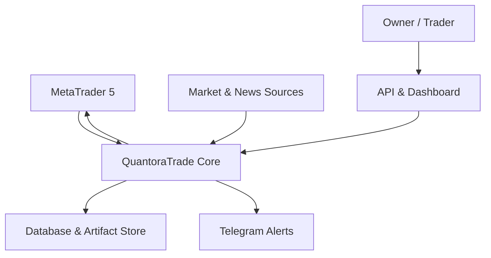
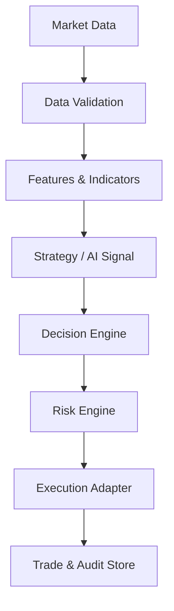

# 04 — System Architecture

## 1. เป้าหมายของสถาปัตยกรรม

QuantoraTrade ใช้สถาปัตยกรรมแบบ **Modular Monolith** ในระยะแรก เพื่อให้พัฒนาและทดสอบง่าย แต่กำหนดขอบเขตแต่ละโมดูลชัดเจนพอที่จะแยกเป็น service ภายหลังได้

ระบบต้อง:

- รองรับหลายสินทรัพย์และหลาย timeframe
- ไม่เขียนกฎผูกกับ symbol ใดโดยตรง
- ใช้ logic ชุดเดียวกันใน Backtest, Paper Trade และ Live Trade
- บังคับให้ทุกคำสั่งผ่าน Risk Engine
- ตรวจสอบย้อนหลังได้ตั้งแต่ข้อมูลต้นทางจนถึงผลการส่งคำสั่ง
- หยุดอย่างปลอดภัยเมื่อข้อมูลหรือ dependency ผิดปกติ

## 2. System Context



Market & News Sources เป็นส่วนต่อขยายในอนาคต ระบบ MVP ต้องทำงานได้โดยไม่มี news provider

## 3. Core Processing Flow



กฎสำคัญ:

1. ข้อมูลที่ไม่ผ่าน validation ห้ามเข้าสู่ Signal Engine
2. AI ส่งได้เพียง prediction และ confidence
3. Decision Engine รวมหลักฐานและสร้างคำตัดสิน BUY/SELL/HOLD
4. Risk Engine เป็นด่านสุดท้ายและปฏิเสธคำสั่งได้เสมอ
5. Execution Adapter แยกตาม mode และ broker
6. ทุกขั้นสร้าง event สำหรับ audit

## 4. Architectural Style

### 4.1 Modular Monolith

MVP รันเป็น application เดียว แต่แบ่ง package ตาม business capability ไม่แบ่งตามชนิดไฟล์ เช่น controllers/services/helpers รวมกันทั้งระบบ

ข้อดี:

- เริ่มต้นง่ายและ debug ง่าย
- ทำ transaction และ integration test ได้ตรงไปตรงมา
- ลดภาระ deployment ขณะที่ระบบยังอยู่ในช่วงค้นหากลยุทธ์
- แยก service ภายหลังได้จากขอบเขตที่กำหนดไว้แล้ว

### 4.2 Ports and Adapters

Core domain ห้าม import SDK ของ MT5, Telegram, database หรือ web framework โดยตรง การเชื่อมต่อภายนอกต้องผ่าน interface หรือ port

ตัวอย่าง ports:

- `MarketDataPort`
- `BrokerPort`
- `NotificationPort`
- `TradeRepositoryPort`
- `ModelInferencePort`
- `ClockPort`

Adapters ระยะแรก:

- `MT5MarketDataAdapter`
- `MT5BrokerAdapter`
- `PaperBrokerAdapter`
- `PostgresTradeRepository`
- `TelegramNotificationAdapter`

## 5. Module Boundaries

| Module | หน้าที่ | ห้ามทำ |
|---|---|---|
| Configuration | โหลดและตรวจ config, symbol specs, environment | เก็บ secret ใน repository |
| Market Data | ดึง normalize และจัดลำดับ OHLCV | สร้างคำสั่งซื้อขาย |
| Data Quality | ตรวจ missing, duplicate, stale และ outlier | แก้ข้อมูลโดยไม่บันทึกเหตุผล |
| Features | คำนวณ EMA, RSI, MACD, ATR, S/R และ patterns | อ่านข้อมูลอนาคต |
| Strategy | สร้าง candidate signal จากกฎ | ติดต่อ broker |
| AI | train/infer และคืน prediction/confidence | ส่ง order หรือข้าม Risk Engine |
| Decision | รวม signal, AI และ market state เป็น BUY/SELL/HOLD | คำนวณ lot โดยไม่ผ่าน Risk |
| Risk | position sizing, exposure, SL/TP และ guardrails | อนุมัติเมื่อข้อมูล symbol ไม่ครบ |
| Execution | ส่ง/ยกเลิก/ตรวจ order ตาม mode | เปลี่ยน strategy decision |
| Portfolio | position, exposure, balance และ P&L | ใช้ข้อมูลที่ไม่ยืนยันสถานะ |
| Backtest | จำลองกลยุทธ์ด้วย historical data | ใช้ future data |
| Monitoring | health, metrics, logs และ alerts | เปิด Live Trade อัตโนมัติ |
| API | control plane และ query results | ฝัง business logic หลัก |
| Audit | บันทึก lineage และเหตุการณ์ | ลบหรือแก้ประวัติโดยไร้ร่องรอย |

## 6. Multi-Asset Domain Model

### 6.1 Symbol Specification

ทุก symbol ต้องมี specification จาก broker หรือ configuration:

```yaml
symbols:
  XAUUSD:
    asset_class: metal
    enabled: true
    timeframes: [M5, M15, H1]
    risk_profile: gold_default

  EURUSD:
    asset_class: forex
    enabled: true
    timeframes: [M5, M15, H1]
    risk_profile: forex_major

  GBPUSD:
    asset_class: forex
    enabled: true
    timeframes: [M15, H1]
    risk_profile: forex_major
```

ค่าทางเทคนิค เช่น digits, point, tick size, tick value, minimum lot, lot step และ contract size ควรอ่านจาก broker ในขณะเริ่มระบบ แล้วตรวจเทียบกับข้อจำกัดใน config

### 6.2 Core Entities

- `Instrument`: symbol, asset class และ broker specification
- `Candle`: symbol, timeframe, open time และ OHLCV
- `FeatureSet`: values พร้อม feature version
- `Signal`: symbol, timeframe, action, confidence, reasons และ strategy version
- `Decision`: final action พร้อมหลักฐานและสถานะ risk เบื้องต้น
- `RiskAssessment`: approved/rejected, size, SL, TP และเหตุผล
- `OrderIntent`: คำสั่งที่ผ่าน Risk Engine และมี idempotency key
- `BrokerOrder`: สถานะคำสั่งจาก broker
- `Position`: สถานะล่าสุดที่ reconcile กับ broker
- `TradeEvent`: append-only audit event

### 6.3 Multi-Asset Rules

- ห้าม hard-code pip, tick, lot หรือ trading session
- ทุก record ต้องมี `symbol` และ `timeframe` เมื่อเกี่ยวข้อง
- ใช้ UTC ภายในระบบ
- Strategy parameter รองรับ global default และ per-symbol override
- Risk Engine ต้องคำนวณทั้งความเสี่ยงราย order ราย symbol และรวมทั้ง portfolio
- ตรวจ correlation และ currency exposure ในระยะหลัง เช่นการถือ EURUSD และ GBPUSD พร้อมกัน

## 7. Operating Modes

| Mode | Data | Execution | เงินจริง |
|---|---|---|---|
| Backtest | Historical | Simulator | ไม่ใช้ |
| Paper | Live/Delayed | Paper adapter | ไม่ใช้ |
| Live | Live | Broker adapter | ใช้ |

ทั้งสาม mode ต้องเรียก Strategy, Decision และ Risk ผ่าน interface เดียวกัน ความแตกต่างอยู่ที่ clock, data feed และ execution adapter

Live mode ต้องมีเงื่อนไขทั้งหมด:

- `TRADING_MODE=live`
- feature flag เปิดใช้งาน
- config ผ่าน validation
- broker connection พร้อม
- Kill Switch พร้อมใช้งาน
- เจ้าของโครงการอนุมัติ

## 8. Decision and Risk Contract

### Candidate Signal

```json
{
  "symbol": "EURUSD",
  "timeframe": "M15",
  "action": "BUY",
  "confidence": 0.72,
  "strategy_version": "ema-rsi-v1",
  "reasons": ["EMA9 crossed above EMA21", "RSI recovered above 50"],
  "observed_at": "2026-08-15T15:00:00Z"
}
```

### Risk Outcome

```json
{
  "approved": true,
  "symbol": "EURUSD",
  "volume": 0.05,
  "stop_loss": 1.1642,
  "take_profit": 1.1718,
  "risk_amount": 25.0,
  "reasons": ["within per-trade and portfolio limits"]
}
```

ถ้า `approved=false` Execution Engine ต้องไม่มีทางส่งคำสั่งได้

## 9. Persistence

### PostgreSQL

เก็บข้อมูลเชิงธุรกรรมและ audit:

- instruments
- candles metadata
- signals
- decisions
- risk assessments
- orders
- fills
- positions
- strategy runs
- model versions
- system events

### Artifact Store

เก็บข้อมูลขนาดใหญ่หรือไฟล์ที่สร้างจากงานวิจัย:

- historical datasets
- trained models
- backtest reports
- charts
- experiment artifacts

ระยะแรกสามารถใช้ local filesystem สำหรับ development และเปลี่ยนเป็น object storage ภายหลังผ่าน adapter

## 10. API Boundary

FastAPI ทำหน้าที่เป็น control plane:

- `GET /health`
- `GET /status`
- `POST /start`
- `POST /stop`
- `GET /symbols`
- `GET /signals`
- `GET /trades`
- `GET /report`

คำสั่ง `/start` ห้ามเปลี่ยนจาก paper เป็น live โดยอัตโนมัติ การเปลี่ยน mode ต้องใช้ configuration และ authorization แยกต่างหาก

## 11. Observability and Safety

- Structured JSON logs
- correlation ID ตั้งแต่ market event ถึง broker order
- metrics แยกตาม symbol, timeframe, strategy และ mode
- heartbeat ของ data feed และ execution connection
- alert เมื่อ stale data, rejected order, daily loss limit หรือ reconciliation mismatch
- Kill Switch หยุดการสร้าง order ใหม่ทันที
- circuit breaker เมื่อ broker หรือ data provider ผิดปกติ
- reconciliation ตรวจ local positions เทียบ broker เป็นระยะ

## 12. Technology Stack

| Area | Technology | เหตุผล |
|---|---|---|
| Language | Python 3.12 | ecosystem ด้าน data, AI และ automation |
| API | FastAPI + Pydantic | type-safe contract และ validation |
| Trading adapter | MetaTrader5 Python package | เชื่อม MT5 ในระยะแรก |
| Data processing | pandas, NumPy | research และ feature engineering |
| Indicators | pandas-ta หรือ implementation ภายใน | เริ่มเร็วและทดสอบสูตรได้ |
| Database | PostgreSQL | transaction และ query งาน trading |
| ORM/Migrations | SQLAlchemy + Alembic | schema และ migration ที่ควบคุมได้ |
| Configuration | YAML + Pydantic Settings | อ่านง่ายและ validate ได้ |
| Testing | pytest | unit, integration และ regression |
| Quality | Ruff, mypy, pre-commit | lint, format และ type checking |
| API packaging | Docker | environment ทำซ้ำได้ |
| Monitoring | Prometheus-compatible metrics + structured logs | ตรวจสุขภาพและวิเคราะห์ incident |
| Notification | Telegram Bot API | แจ้งเตือนระยะแรก |

Technology Stack เป็นข้อเสนอเริ่มต้น การเปลี่ยน library ต้องบันทึกใน Project Decisions

## 13. Proposed Repository Structure

```text
QuantoraTrade/
├── config/
│   ├── symbols.example.yaml
│   ├── strategies.example.yaml
│   └── risk.example.yaml
├── docs/
├── src/quantora_trade/
│   ├── api/
│   ├── application/
│   ├── backtest/
│   ├── config/
│   ├── domain/
│   ├── execution/
│   ├── features/
│   ├── infrastructure/
│   ├── market_data/
│   ├── monitoring/
│   ├── portfolio/
│   ├── risk/
│   └── strategies/
├── tests/
│   ├── unit/
│   ├── integration/
│   └── regression/
├── .env.example
├── .gitignore
├── pyproject.toml
└── README.md
```

## 14. Deployment Topology — MVP

MVP ใช้ 3 runtime components:

1. **Trading Worker** — market loop, analysis, decision, risk และ execution
2. **API** — control plane และ query
3. **PostgreSQL** — state และ audit

Worker และ API ใช้ codebase เดียวกัน แต่รันคนละ process เพื่อไม่ให้ request จาก dashboard รบกวน trading loop

## 15. Failure Policy

| Failure | Default action |
|---|---|
| Stale/missing market data | HOLD และแจ้งเตือน |
| Unknown symbol specification | ปฏิเสธ order |
| AI unavailable | HOLD หรือ strategy fallback ที่ประกาศไว้ |
| Database unavailable | หยุด order ใหม่ |
| Broker disconnected | หยุด order ใหม่และ reconcile เมื่อกลับมา |
| Risk calculation error | ปฏิเสธ order |
| Duplicate event/order | ไม่ส่งซ้ำและบันทึก warning |
| Config validation failed | application ไม่เริ่มทำงาน |

หลักการคือ **fail closed**: เมื่อไม่แน่ใจ ระบบต้องไม่เปิดความเสี่ยงใหม่

## 16. Architecture Decisions for MVP

- ใช้ Modular Monolith ก่อน microservices
- Core domain ไม่ขึ้นกับ MT5 หรือ FastAPI
- Multi-Asset เป็นข้อกำหนดตั้งแต่ data model
- PostgreSQL เป็น system of record
- Event/audit records เป็น append-only
- Live Trading disabled by default
- Risk Engine เป็น mandatory gate
- เริ่มแบบ synchronous processing และประเมิน message broker เมื่อมีหลักฐานว่าจำเป็น
