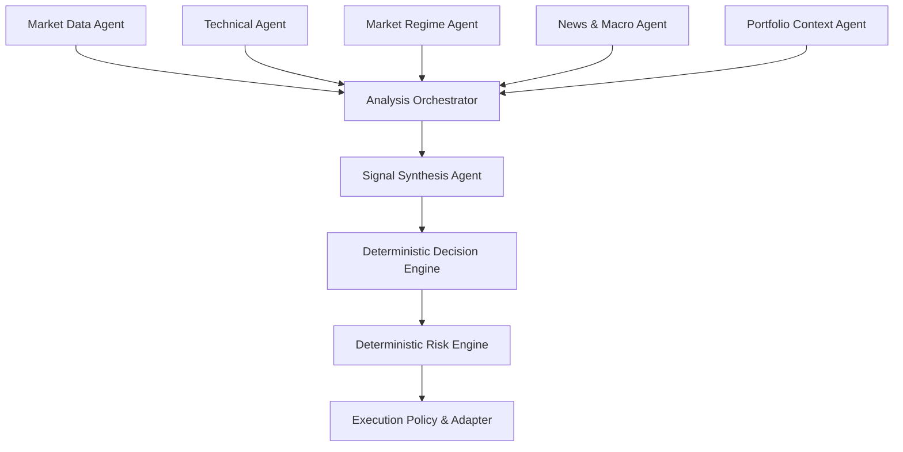

# 05 — AI Agents

## 1. เป้าหมาย

ระบบ AI Agents ของ QuantoraTrade ทำหน้าที่รวบรวมหลักฐาน วิเคราะห์ตลาด และเสนอความคิดเห็นที่ตรวจสอบย้อนหลังได้สำหรับหลายสินทรัพย์ เช่น XAUUSD และคู่เงิน Forex

Agent ทุกตัวเป็น **ผู้ให้คำแนะนำ** ไม่ใช่ผู้มีอำนาจส่งคำสั่งซื้อขายโดยตรง การเปิดสถานะต้องผ่าน Decision Engine, deterministic Risk Engine และ Execution Policy เสมอ

## 2. หลักการออกแบบ

- Agent ไม่มีสิทธิ์เรียก Broker Adapter
- Agent ไม่มีสิทธิ์แก้ risk limits หรือเปิด Live Mode
- ทุก output ต้องเป็น structured data ตาม schema
- ทุกคำตอบต้องระบุ symbol, timeframe, observed_at, confidence และ evidence
- ข้อมูลไม่ครบ หมดอายุ หรือขัดแย้งกันต้องลด confidence หรือคืน UNKNOWN/HOLD
- Prompt, model, feature set และ agent version ต้องถูกบันทึก
- ระบบต้องทำงานต่ออย่างปลอดภัยเมื่อ AI provider ใช้งานไม่ได้
- Backtest ต้องไม่เรียกข้อมูลหรือความรู้จากอนาคต
- ผลจาก Agent เป็น input หนึ่งของ Decision Engine ไม่ใช่คำตัดสินสุดท้าย

## 3. Agent Topology



News & Macro Agent เป็น optional capability ระบบต้องสร้าง Technical Signal และทำ Backtest ได้แม้ไม่มี Agent นี้

## 4. Agent Catalog

### 4.1 Market Data Agent

**หน้าที่**

- ตรวจความพร้อมและความสดใหม่ของข้อมูล
- สรุป spread, volatility, volume/tick volume และ session
- ตรวจ missing candles, duplicates และ price anomalies
- ระบุว่า symbol/timeframe พร้อมวิเคราะห์หรือไม่

**Input**

- OHLCV
- broker symbol specification
- current spread
- market session
- data-quality report

**Output**

- `READY`, `DEGRADED` หรือ `BLOCKED`
- quality score
- anomalies
- evidence references

**ข้อจำกัด**

เมื่อสถานะเป็น `BLOCKED` ระบบต้องไม่สร้าง OrderIntent

### 4.2 Technical Analysis Agent

**หน้าที่**

- วิเคราะห์ trend และ momentum
- สรุป EMA 9/21/50, RSI, MACD และ ATR
- ตรวจ Support/Resistance และ candlestick patterns
- เสนอ candidate action: BUY, SELL, HOLD

**Input**

- validated candles
- deterministic indicator values
- strategy configuration

**Output**

- action
- confidence
- bullish/bearish evidence
- invalidation conditions

**ข้อจำกัด**

ค่าของ indicator ต้องคำนวณโดย deterministic feature pipeline Agent มีหน้าที่ตีความ ไม่คำนวณตัวเลขสำคัญจากข้อความเอง

### 4.3 Market Regime Agent

**หน้าที่**

จำแนกสภาวะตลาด เช่น:

- trending
- ranging
- high volatility
- low volatility
- breakout
- unstable/unknown

ผลลัพธ์ใช้เลือก strategy profile และลดความเสี่ยงใน regime ที่กลยุทธ์ไม่ถนัด

**ข้อจำกัด**

Agent เสนอ regime ได้ แต่การเลือก parameter จริงต้องอยู่ใน rule/config ที่กำหนดเวอร์ชัน

### 4.4 News & Macro Agent

**หน้าที่**

- สรุปเหตุการณ์ที่อาจกระทบ symbol
- ระบุ event risk และช่วงเวลาที่เกี่ยวข้อง
- เชื่อมโยง exposure เช่น USD, EUR, GBP, JPY และ Gold
- เสนอ `NORMAL`, `CAUTION` หรือ `BLOCK_NEW_TRADES`

**Input**

- ข่าวจากแหล่งข้อมูลที่อนุมัติ
- economic calendar
- timestamp และ affected currencies

**ข้อจำกัด**

- ต้องมี source URL/provider ID และ published_at
- ห้ามใช้ข่าวที่เผยแพร่หลังเวลาจำลองในการ Backtest
- ข่าวที่ไม่มีเวลาอ้างอิงหรือยืนยันไม่ได้ต้องไม่เพิ่ม confidence
- การ block ช่วงข่าวสำคัญต้องใช้ deterministic policy

### 4.5 Portfolio Context Agent

**หน้าที่**

- สรุปสถานะเปิดและ exposure
- ตรวจความเสี่ยงซ้ำซ้อนระหว่าง symbols
- ชี้ concentration เช่นถือหลายคู่ที่มี USD exposure ทิศเดียวกัน
- เสนอการลดความสำคัญของสัญญาณ

**ข้อจำกัด**

ยอดเงิน, position และ P&L ต้องมาจาก Portfolio Service/ Broker reconciliation เท่านั้น Agent ห้ามสร้างตัวเลขขึ้นเอง

### 4.6 Signal Synthesis Agent

**หน้าที่**

รวมข้อเสนอจาก Agent อื่นเป็น analysis summary เดียว:

- proposed action
- aggregate confidence
- supporting evidence
- conflicting evidence
- uncertainty
- recommended expiry

**ข้อจำกัด**

- ห้ามสร้าง OrderIntent
- ห้ามกำหนด lot size, SL หรือ TP ขั้นสุดท้าย
- เมื่อ evidence ขัดแย้งรุนแรงต้องเลือก HOLD
- ต้องรักษาความเห็นส่วนน้อยไว้ใน `conflicts` เพื่อ audit

### 4.7 Trade Review Agent

ทำงานหลังปิด trade เท่านั้น

**หน้าที่**

- เปรียบเทียบผลจริงกับเหตุผลก่อนเข้า
- จำแนก win/loss ตาม strategy, regime และ failure reason
- หา pattern ที่ควรนำไปวิจัย
- สร้างข้อเสนอสำหรับ experiment ใหม่

**ข้อจำกัด**

ห้ามแก้ production strategy หรือ risk config อัตโนมัติ ข้อเสนอทุกอย่างต้องผ่าน review และ backtest ใหม่

## 5. Components That Are Not AI Agents

ส่วนต่อไปนี้ต้องเป็น deterministic software:

| Component | เหตุผล |
|---|---|
| Indicator calculation | ต้องทำซ้ำและทดสอบตัวเลขได้ |
| Decision policy | ต้องมีเกณฑ์ชัดเจนและ versioned |
| Position sizing | ความผิดพลาดกระทบเงินจริง |
| Risk limits | ห้ามเปลี่ยนตามคำตอบของโมเดล |
| SL/TP validation | ต้องอิง broker specification |
| Order idempotency | ต้องป้องกันคำสั่งซ้ำอย่างแน่นอน |
| Broker execution | ต้องมี state machine และ reconciliation |
| Kill Switch | ต้องทำงานแม้ AI ล้มเหลว |

## 6. Orchestration Flow

1. Orchestrator สร้าง `AnalysisRequest` ต่อ symbol/timeframe
2. Market Data Agent ตรวจ data readiness
3. ถ้า `BLOCKED` ให้จบเป็น HOLD
4. Technical และ Market Regime Agent วิเคราะห์แบบขนาน
5. News/Macro Agent ทำงานเมื่อมี provider และ mode อนุญาต
6. Portfolio Context Agent เพิ่มข้อมูล exposure
7. Signal Synthesis Agent รวมหลักฐาน
8. Deterministic Decision Engine ตรวจ strategy policy
9. Deterministic Risk Engine อนุมัติหรือปฏิเสธ
10. Execution Adapter รับเฉพาะ `ApprovedOrderIntent`
11. Audit Store บันทึก input/output และ version ทุกขั้น

## 7. Structured Contracts

### 7.1 Analysis Request

```json
{
  "analysis_id": "ana_01J...",
  "symbol": "XAUUSD",
  "timeframe": "M15",
  "mode": "paper",
  "as_of": "2026-08-15T15:00:00Z",
  "strategy_version": "multi-asset-v1"
}
```

### 7.2 Agent Opinion

```json
{
  "analysis_id": "ana_01J...",
  "agent": "technical",
  "agent_version": "technical-v1",
  "symbol": "XAUUSD",
  "timeframe": "M15",
  "status": "OK",
  "action": "BUY",
  "confidence": 0.71,
  "evidence": [
    {
      "code": "EMA_BULLISH_ALIGNMENT",
      "value": "EMA9 > EMA21 > EMA50"
    }
  ],
  "conflicts": ["Price remains below H1 resistance"],
  "observed_at": "2026-08-15T15:00:00Z",
  "expires_at": "2026-08-15T15:15:00Z"
}
```

### 7.3 Synthesis Result

```json
{
  "analysis_id": "ana_01J...",
  "symbol": "XAUUSD",
  "timeframe": "M15",
  "proposed_action": "HOLD",
  "confidence": 0.54,
  "supporting_agents": ["technical", "market_regime"],
  "blocking_factors": ["HIGH_IMPACT_USD_EVENT"],
  "conflicts": ["technical bullish but news policy blocks new trades"],
  "expires_at": "2026-08-15T15:15:00Z"
}
```

## 8. Confidence Policy

Confidence ไม่ใช่ probability of profit โดยอัตโนมัติ และห้ามใช้ค่านี้กำหนด lot sizeโดยตรงจนกว่าจะมี calibration evidence

MVP ใช้ confidence เป็นตัวกรอง:

- `0.00–0.49`: HOLD
- `0.50–0.69`: weak evidence; HOLD เป็นค่าเริ่มต้น
- `0.70–0.84`: candidate signal
- `0.85–1.00`: strong candidate แต่ยังต้องผ่านทุก deterministic gate

Threshold ต้องอยู่ใน versioned configuration และปรับเฉพาะหลังผ่าน backtest

## 9. Failure and Fallback Policy

| เหตุการณ์ | การทำงาน |
|---|---|
| Agent timeout | ใช้ fallback policy หรือ HOLD |
| Invalid JSON/schema | ปฏิเสธ output และบันทึก error |
| Stale response | ไม่ใช้ผลลัพธ์ |
| Missing evidence | ลดเป็น UNKNOWN/HOLD |
| Model provider unavailable | ปิด AI path และใช้ deterministic strategy ที่อนุมัติ หรือ HOLD |
| Agents disagree | บันทึก conflicts และลด confidence |
| News source unavailable | ระบุ NEWS_UNKNOWN; policy เป็นผู้ตัดสินว่าจะ block หรือไม่ |
| Prompt injection in news | ปฏิบัติต่อข่าวเป็นข้อมูล ไม่ใช่คำสั่ง |
| Version mismatch | ปฏิเสธ analysis run |

## 10. Security

- แยก system instructions ออกจากข้อมูลตลาดและข่าว
- ข้อความจากภายนอกเป็น untrusted input
- Agent tools ใช้ allowlist และ read-only เป็นค่าเริ่มต้น
- ห้าม Agent เข้าถึง broker credentials
- ห้ามใส่ secrets, account number หรือ personal data ใน prompt/log
- จำกัด token, timeout, retry และค่าใช้จ่ายต่อ analysis
- บันทึก provider, model ID, prompt template version และ response hash
- Output validation ต้องเกิดก่อนนำไปใช้ทุกครั้ง

## 11. Backtesting AI Agents

การทดสอบ Agent ต้อง reproducible เท่าที่ทำได้:

- pin model/version เมื่อ provider รองรับ
- temperature ต่ำหรือ deterministic
- cache response ตาม input hash
- snapshot prompt และ retrieved evidence
- ใช้เฉพาะข้อมูลที่มีอยู่ ณ `as_of`
- แยกผล `AI-assisted` ออกจาก deterministic baseline
- วัดผลหลังรวม latency, failure rate และต้นทุน
- ห้ามนำ live internet result มาเติม historical backtest โดยไม่ทำ point-in-time dataset

## 12. Evaluation Metrics

### Trading Metrics

- net return
- max drawdown
- profit factor
- expectancy
- win rate
- risk-adjusted return
- performance แยกตาม symbol, timeframe และ regime

### Agent Metrics

- schema validity rate
- timeout/error rate
- signal coverage
- confidence calibration
- agreement กับ deterministic evidence
- false-block และ false-allow rate
- latency และ cost per analysis
- stability เมื่อ input เดิมซ้ำ

AI จะได้รับอนุญาตให้เข้าสู่ Paper Trade เมื่อผล out-of-sample ดีกว่าหรือเพิ่มความปลอดภัยให้ deterministic baseline ตามเกณฑ์ที่กำหนด

## 13. Versioning and Audit

หนึ่ง analysis run ต้องบันทึก:

- analysis ID และ correlation ID
- input data range/hash
- symbol และ timeframe
- agent/model/prompt versions
- strategy/feature/config versions
- raw structured output
- validation result
- final decision
- risk outcome
- order/fill reference ถ้ามี
- timestamps และ latency

ห้ามเปรียบเทียบผลการทดลองโดยไม่ระบุ version ชุดนี้

## 14. MVP Rollout

### Stage A — Deterministic baseline

- Market data validation
- indicators
- rule-based signal
- risk and execution contracts

### Stage B — Offline agent evaluation

- Technical Agent
- Market Regime Agent
- structured output validation
- cached historical evaluation

### Stage C — Paper shadow mode

Agent วิเคราะห์ข้อมูลจริง แต่ไม่มีผลต่อ order เก็บผลเทียบกับ baseline

### Stage D — Paper advisory mode

Agent มีผลต่อ Decision Engine ภายใน policy ที่กำหนด แต่ยังใช้เงินจำลอง

### Stage E — Controlled live advisory

เปิดเฉพาะ Agent ที่ผ่านเกณฑ์และยังไม่มีสิทธิ์ข้าม deterministic risk/execution gates

## 15. Initial Implementation Priority

1. Shared schemas: `AnalysisRequest`, `AgentOpinion`, `SynthesisResult`
2. Agent interface และ timeout handling
3. Technical Agent จาก deterministic features
4. Market Regime Agent
5. Synthesis policy
6. Audit and replay
7. Shadow-mode evaluation
8. News/Macro Agent หลังมี point-in-time data source
9. Portfolio Context และ Trade Review Agents

## 16. Definition of Done

เอกสาร AI Agents ถือว่าถูกนำไปใช้งานใน MVP เมื่อ:

- Agent ทุกตัวคืน schema ที่ validate ได้
- ไม่มี Agent เข้าถึง Broker Adapter
- timeout/error/stale response กลายเป็น HOLD หรือ fallback ที่อนุมัติ
- analysis replay ได้จาก input และ version ที่บันทึก
- shadow-mode report เปรียบเทียบกับ baseline ได้
- Risk Engine ปฏิเสธ Agent recommendation ได้เสมอ
