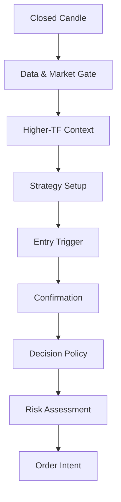
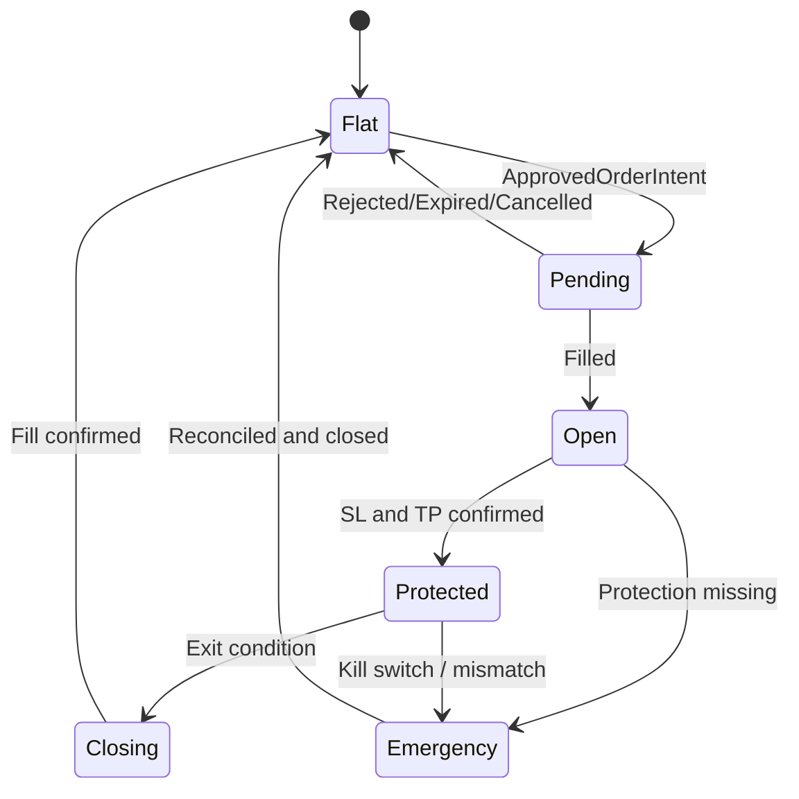

# 06 — Trading Logic

## 1. Purpose

เอกสารนี้กำหนด Trading Logic เวอร์ชันแรกของ QuantoraTrade สำหรับ Metals และ Forex ให้มีความชัดเจนเพียงพอสำหรับการเขียนโค้ด การทดสอบย้อนหลัง และการตรวจสอบผล

Logic นี้เป็น **สมมติฐานสำหรับการวิจัย** ไม่ใช่การรับประกันกำไร ค่า threshold ทุกค่าต้องผ่าน Backtest และ Paper Trade ก่อนใช้งานจริง

## 2. Design Principles

- ตัดสินใจเมื่อแท่งราคาปิดแล้วเท่านั้น
- ห้ามใช้ข้อมูลจากแท่งอนาคต
- Signal, Decision, Risk และ Execution เป็นคนละขั้น
- Strategy ห้ามกำหนด lot size
- Risk Engine ห้ามเปลี่ยน BUY เป็น SELL หรือ SELL เป็น BUY
- ไม่มีข้อมูลครบหรือเงื่อนไขขัดแย้งให้เลือก HOLD
- กฎหลักใช้ร่วมกันได้หลาย symbol
- ค่าเฉพาะ symbol/timeframe มาจาก versioned configuration
- ใช้ราคาและข้อกำหนดจริงจาก broker ไม่ hard-code pip หรือ digits
- หนึ่ง strategy version ต้องให้ผลเดิมเมื่อใช้ข้อมูลและ config เดิม

## 3. Supported Scope — MVP

### Asset classes

- Metals: เริ่มจาก XAUUSD
- Forex majors: เริ่มจาก EURUSD, GBPUSD และ USDJPY
- เพิ่ม symbol อื่นได้ผ่าน configuration เมื่อมี broker specification และผล Backtest

### Timeframes

- Entry: M5 หรือ M15
- Context: M15 หรือ H1
- ค่าเริ่มต้นสำหรับ baseline: Entry M15, Context H1

### Actions

- `BUY`
- `SELL`
- `HOLD`

## 4. Strategy Pipeline



ทุกขั้นต้องส่งเหตุผลและ code ที่ตรวจสอบได้ ถ้าขั้นใดไม่ผ่านให้คืน HOLD หรือ REJECTED โดยไม่ข้ามไปขั้นถัดไป

## 5. Pre-Trade Gates

ก่อนวิเคราะห์ Entry ต้องผ่านทุกข้อ:

1. candle ปิดแล้วและ timestamp ถูกต้อง
2. ไม่มี missing/duplicate candles ใน lookback ที่จำเป็น
3. ข้อมูลไม่ stale
4. symbol specification ครบ
5. market session อนุญาต
6. spread ไม่เกิน threshold ของ symbol
7. ไม่มี Kill Switch หรือ circuit breaker
8. ไม่มี event block ตาม deterministic news policy
9. ไม่มีสถานะหรือ pending order ที่ขัดกับ policy
10. Risk Engine ยังไม่ชน daily loss, drawdown หรือ cooldown limit

ถ้าไม่ผ่านให้สร้าง `HOLD` พร้อม reason code เช่น `STALE_DATA`, `SPREAD_TOO_WIDE` หรือ `DAILY_LOSS_LIMIT`

## 6. Deterministic Features

Feature Pipeline คำนวณอย่างน้อย:

- EMA 9
- EMA 21
- EMA 50
- RSI 14
- MACD 12/26/9
- ATR 14
- swing high / swing low
- support / resistance zones
- candle range และ body ratio
- spread และ session
- rolling volatility

ค่าทั้งหมดคำนวณจากแท่งที่ปิดแล้ว การเลือก library ต้องมี regression test เทียบผลอ้างอิง

## 7. Market Context

### Bullish context

เงื่อนไข baseline บน Context Timeframe:

- `EMA9 > EMA21 > EMA50`
- EMA21 มี slope เป็นบวก
- ราคาปิดเหนือ EMA21
- Market Regime ไม่เป็น unstable

### Bearish context

- `EMA9 < EMA21 < EMA50`
- EMA21 มี slope เป็นลบ
- ราคาปิดต่ำกว่า EMA21
- Market Regime ไม่เป็น unstable

### Neutral context

กรณีอื่นทั้งหมดเป็น Neutral และ baseline strategy คืน HOLD

## 8. Baseline Strategy A — Trend Pullback

ใช้จับการย่อตัวตามแนวโน้มหลัก

### 8.1 BUY setup

ต้องผ่านทุกข้อ:

1. H1 เป็น Bullish context
2. บน Entry Timeframe ราคา pullback เข้าใกล้ EMA21 หรือ support zone
3. ราคาปิดกลับเหนือ EMA9
4. RSI ฟื้นขึ้นเหนือ threshold ที่ config กำหนด
5. MACD histogram ดีขึ้นหรือเกิด bullish confirmation
6. ไม่มี resistance ใกล้จน Reward-to-Risk ต่ำกว่าเกณฑ์
7. candle trigger ไม่ใหญ่เกิน ATR multiple ที่กำหนด

### 8.2 SELL setup

กลับด้านจาก BUY:

1. H1 เป็น Bearish context
2. ราคาดีดเข้าใกล้ EMA21 หรือ resistance zone
3. ราคาปิดกลับต่ำกว่า EMA9
4. RSI อ่อนลงต่ำกว่า threshold
5. MACD histogram แย่ลงหรือเกิด bearish confirmation
6. ไม่มี support ใกล้จน Reward-to-Risk ต่ำกว่าเกณฑ์
7. candle trigger ไม่ใหญ่เกิน ATR multiple

### 8.3 Invalidation

คืน HOLD เมื่อ:

- Context และ Entry Timeframe ขัดแย้งรุนแรง
- ราคาอยู่กลาง range โดยไม่มี edge
- ATR ต่ำ/สูงผิดปกติตาม regime policy
- spread สูง
- trigger candle ยังไม่ปิด
- stop distance ต่ำกว่า broker minimum หรือสูงเกิน risk policy

## 9. Baseline Strategy B — Breakout Confirmation

Strategy นี้แยก version และเปิด/ปิดได้ ไม่รวมผลกับ Trend Pullback โดยอัตโนมัติ

### BUY breakout

- ราคาปิดเหนือ resistance zone
- breakout distance ผ่าน minimum ATR fraction
- candle body ratio ผ่านเกณฑ์
- แท่งถัดไปยืนยันหรือ retest ตาม configuration
- H1 context ไม่เป็น Bearish
- spread และ volatility ผ่าน policy

### SELL breakout

ใช้กฎกลับด้านกับ support zone และ H1 context

### False-breakout protection

- ไม่เข้าเพราะ wick ทะลุเพียงอย่างเดียว
- ไม่ใช้ zone ที่คำนวณจาก future bars
- จำกัดระยะไล่ราคา
- หลีกเลี่ยง Entry เมื่อ Reward-to-Risk ต่ำกว่าเกณฑ์

## 10. Confirmation Score

แต่ละ evidence คืนค่า `-1`, `0` หรือ `+1` ตามทิศของ Candidate Signal เช่น:

| Evidence | BUY positive | SELL positive |
|---|---|---|
| Context trend | Bullish | Bearish |
| EMA trigger | Close above EMA9 | Close below EMA9 |
| RSI | Recovering | Weakening |
| MACD | Improving | Deteriorating |
| S/R location | Near support | Near resistance |
| Regime | Strategy-compatible | Strategy-compatible |

Decision Engine ใช้ weighted score จาก config ไม่ใช้ค่า hard-code ใน source code

ตัวอย่าง policy เริ่มต้นเพื่อ Backtest:

- score ต่ำกว่า minimum: HOLD
- score ผ่าน minimum แต่มี hard block: HOLD
- score ผ่านและไม่มี block: Candidate BUY/SELL
- BUY และ SELL ใกล้เคียงกันภายใน conflict margin: HOLD

ค่าคะแนนจริงยังเป็น Open Decision จนกว่าจะมี baseline report

## 11. AI Integration

AI Agents เพิ่มข้อมูลได้ในส่วน:

- regime classification
- evidence interpretation
- news/macro context
- confidence calibration
- conflict summary

AI ไม่มีสิทธิ์:

- เปลี่ยนข้อมูล indicator
- ข้าม pre-trade gate
- สร้าง lot size
- ขยาย risk limit
- ส่ง order
- เปลี่ยน HOLD เป็น order เมื่อ deterministic policy block

หาก AI unavailable ให้ใช้ deterministic baseline ที่อนุมัติ หรือ HOLD ตาม config

## 12. Decision Policy

Decision Engine รับ:

- candidate signal
- technical evidence
- regime
- AI opinions
- portfolio context
- market/data status
- policy version

ผลลัพธ์:

```json
{
  "decision_id": "dec_01J...",
  "symbol": "GBPUSD",
  "timeframe": "M15",
  "strategy": "trend-pullback",
  "strategy_version": "1.0.0",
  "action": "SELL",
  "confidence": 0.74,
  "reason_codes": [
    "H1_BEARISH_CONTEXT",
    "PULLBACK_TO_EMA21",
    "M15_BEARISH_TRIGGER"
  ],
  "invalidated_by": [],
  "expires_at": "2026-08-15T15:15:00Z"
}
```

Decision ที่หมดอายุห้ามนำไป Execution

## 13. Stop Loss Logic

Strategy เสนอ structural stop candidate แต่ Risk Engine เป็นผู้ตรวจและอนุมัติ

ตัวเลือก baseline:

1. เหนือ/ใต้ swing ล่าสุดพร้อม buffer
2. อีกด้านของ support/resistance zone
3. ATR-based stop ตาม symbol profile

Risk Engine ต้องตรวจ:

- stop อยู่ฝั่งที่ถูกต้องของ Entry
- ระยะไม่น้อยกว่า broker minimum
- ระยะไม่แคบกว่าความผันผวนขั้นต่ำ
- ระยะไม่เกิน maximum stop policy
- position size ที่คำนวณได้อยู่ใน lot limits

ห้ามขยาย Stop Loss หลังเปิดสถานะเพื่อหลีกเลี่ยงการขาดทุน ยกเว้น policy ที่ผ่านการทดสอบและอนุมัติเป็น version ใหม่

## 14. Take Profit Logic

ตัวเลือก baseline:

- fixed Reward-to-Risk multiple
- target ที่ support/resistance ถัดไป
- partial exit + trailing stop ซึ่งต้องทดสอบแยกเป็น strategy variant

ก่อนเข้า trade ต้องมี target ที่ทำให้ expected Reward-to-Risk ผ่านขั้นต่ำหลังรวม spread, commission และ slippage

## 15. Position Sizing Boundary

Trading Logic ส่งให้ Risk Engine:

- proposed entry
- proposed stop
- proposed target
- signal confidence
- strategy ID

Risk Engine คำนวณ volume จาก:

- account equity
- risk amount/percentage
- entry-to-stop distance
- tick size และ tick value
- contract size
- minimum/maximum volume และ volume step
- portfolio exposure

Confidence จาก AI ห้ามเพิ่ม risk per trade ใน MVP

## 16. Position and Order Policy

ค่าเริ่มต้นสำหรับ MVP:

- หนึ่ง active position ต่อ symbol ต่อ strategy
- ไม่เพิ่มสถานะเมื่อมี pending order ที่ใช้ setup เดียวกัน
- ไม่เปิด BUY และ SELL พร้อมกันใน symbol/strategy เดียวกัน
- ไม่ใช้ martingale
- ไม่ถัวขาดทุน
- ไม่เพิ่ม lot หลังแพ้เพื่อเอาคืน
- order ทุกตัวมี idempotency key
- position ในระบบต้อง reconcile กับ broker

## 17. Exit State Machine



### Exit conditions

- Stop Loss
- Take Profit
- strategy invalidation หาก policy อนุญาต
- time-based exit
- end-of-session policy
- risk emergency
- manual close
- broker reconciliation mismatch

Exit ทุกแบบต้องมี reason code และบันทึก intended price, actual fill, slippage และ P&L

## 18. Trailing Stop

Trailing Stop เป็น optional strategy variant ปิดเป็นค่าเริ่มต้นจนผ่าน Backtest

กฎที่ต้องระบุให้ครบก่อนเปิดใช้:

- activation threshold
- trailing distance
- update frequency
- minimum broker stop distance
- behavior เมื่อ spread กว้าง
- ห้ามเลื่อน stop ถอยออกจากกำไรที่ล็อกไว้

ค่าของ XAUUSD ห้ามนำไปใช้กับ Forex โดยตรง ต้อง normalize ด้วย price/tick/ATR หรือมี per-symbol config

## 19. Multi-Timeframe Synchronization

- ใช้เฉพาะแท่ง Context ที่ปิดแล้ว ณ เวลา Entry
- mapping timestamp ต้องใช้ UTC
- M15 decision ห้ามอ่าน H1 candle ที่ยังไม่ปิด
- Backtest และ Live ต้องใช้กติกาการ align bars เดียวกัน
- บันทึก candle IDs ที่ใช้สร้าง decision

## 20. Symbol Configuration

```yaml
strategy:
  trend_pullback:
    version: "1.0.0"
    enabled: true
    entry_timeframe: M15
    context_timeframe: H1
    defaults:
      rsi_period: 14
      atr_period: 14
      min_reward_risk: 1.5
      max_trigger_range_atr: 1.5
    symbols:
      XAUUSD:
        enabled: true
        risk_profile: gold_default
      EURUSD:
        enabled: true
        risk_profile: forex_major
      GBPUSD:
        enabled: true
        risk_profile: forex_major
      USDJPY:
        enabled: true
        risk_profile: forex_major
```

ตัวเลขเป็นค่าเริ่มต้นสำหรับสร้าง baseline เท่านั้น ไม่ถือว่าได้รับอนุมัติสำหรับ Live Trade

## 21. Reason Codes

Reason code ต้องเป็นค่าคงที่ที่ใช้ใน log, database และ report

### Positive

- `H1_BULLISH_CONTEXT`
- `H1_BEARISH_CONTEXT`
- `PULLBACK_TO_EMA21`
- `SUPPORT_REJECTION`
- `RESISTANCE_REJECTION`
- `BULLISH_TRIGGER`
- `BEARISH_TRIGGER`
- `BREAKOUT_CONFIRMED`

### Hold/Reject

- `INSUFFICIENT_HISTORY`
- `STALE_DATA`
- `SPREAD_TOO_WIDE`
- `SESSION_BLOCKED`
- `NEWS_BLOCK`
- `CONFLICTING_SIGNALS`
- `LOW_REWARD_RISK`
- `POSITION_ALREADY_OPEN`
- `DAILY_LOSS_LIMIT`
- `COOLDOWN_ACTIVE`
- `UNKNOWN_SYMBOL_SPEC`
- `DECISION_EXPIRED`

## 22. Backtest Requirements

ทุก strategy variant ต้องทดสอบ:

- แยกตาม symbol และ timeframe
- รวม spread, commission และ slippage
- ไม่มี look-ahead bias
- train/development, validation และ out-of-sample
- trending, ranging และ high-volatility regimes
- sensitivity ของ parameters
- walk-forward analysis
- ผลรวม portfolio และ correlation exposure
- เทียบ baseline แบบไม่มี AI

ห้ามเลือก parameter จากผลกำไรรวมเพียงค่าเดียว ต้องพิจารณา drawdown, trade count, stability และ out-of-sample performance

## 23. Test Scenarios

อย่างน้อยต้องมี:

- BUY/SELL/HOLD ที่ชัดเจน
- แท่ง H1 ยังไม่ปิด
- missing candle
- spread สูง
- session ถูก block
- news block
- insufficient indicator history
- conflicting timeframes
- stop distance ผิด broker rule
- risk limit เต็ม
- duplicate signal/order
- decision หมดอายุ
- symbol ที่ digits/tick size ต่างกัน
- AI timeout และ invalid output
- restart ระหว่างมี position เปิด

## 24. Open Decisions

ต้องมีผลการทดลองก่อนกำหนดค่าจริง:

- รายการ symbols รุ่นแรก
- Entry/Context timeframe ต่อ symbol
- RSI/MACD confirmation thresholds
- Support/Resistance algorithm
- regime classifier
- score weights และ minimum score
- SL/TP method
- minimum Reward-to-Risk
- time exit และ session rules
- spread/slippage limits
- trailing-stop variant
- risk per trade และ portfolio exposure

## 25. Definition of Done

Trading Logic พร้อมเข้าสู่ implementation เมื่อ:

- ทุก rule แปลงเป็น deterministic condition หรือ versioned AI contract ได้
- มี schema สำหรับ signal, decision และ reason codes
- ไม่มีค่า pip/tick/lot ที่ hard-code ตาม symbol
- Entry ใช้เฉพาะ closed candles
- Risk และ Execution แยกจาก Strategy
- Backtest และ Live เรียก logic ชุดเดียวกัน
- test scenarios สำคัญถูกเขียนเป็น automated tests
