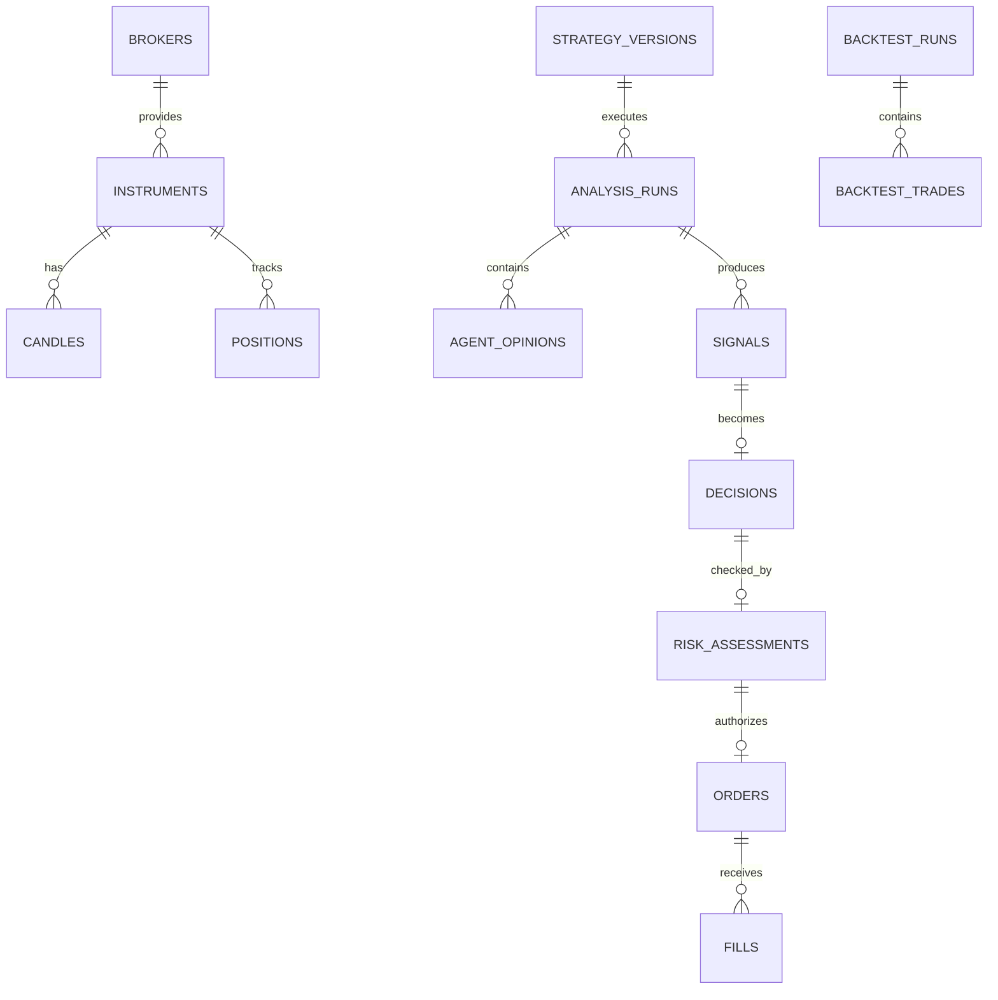

# 07 — Database Design

## 1. Purpose

QuantoraTrade ใช้ PostgreSQL เป็น System of Record สำหรับข้อมูลอ้างอิง การวิเคราะห์ การตัดสินใจ ความเสี่ยง คำสั่งซื้อขาย สถานะพอร์ต และ Audit Trail ใน Backtest, Paper และ Live Mode

การออกแบบต้องรองรับ:

- หลาย Symbol และหลาย Timeframe
- ข้อมูลจากหลาย Broker/Provider
- Strategy, Model, Prompt และ Configuration หลายเวอร์ชัน
- การติดตามตั้งแต่ Candle ถึง Signal, Decision, Risk, Order และ Fill
- การป้องกันคำสั่งซ้ำ
- การทำ Replay และตรวจสอบย้อนหลัง
- การแยกข้อมูลทดลองออกจากข้อมูล Paper/Live

## 2. Storage Boundaries

### PostgreSQL

เก็บข้อมูลที่ต้อง query, join, enforce constraints หรือ transaction:

- instruments และ broker specifications
- analysis runs
- signals และ agent opinions
- decisions และ risk assessments
- orders, fills, positions และ account snapshots
- strategy/model/config versions
- system events และ audit records
- backtest run metadata และ metrics

### Artifact Store

เก็บไฟล์ขนาดใหญ่:

- raw historical datasets
- feature datasets
- trained model files
- backtest equity curves และรายงาน
- charts
- prompt/response archive ที่มีขนาดใหญ่

PostgreSQL เก็บ URI, checksum, size, content type และ version ของ artifact ไม่เก็บ binary ขนาดใหญ่ในตารางหลัก

## 3. General Conventions

- Database: PostgreSQL
- Schema หลัก: `quantora`
- Primary key: UUID v7 หรือ ULID เพื่อเรียงตามเวลาได้
- เวลา: `TIMESTAMPTZ` และเก็บเป็น UTC
- ราคา/เงิน/ปริมาณ: `NUMERIC` ห้ามใช้ floating point
- Enum ที่เปลี่ยนบ่อย: ใช้ `VARCHAR + CHECK` หรือ lookup table
- ชื่อตารางและ column: `snake_case`
- ทุกตารางสำคัญมี `created_at`
- ตาราง mutable มี `updated_at` และ optimistic version เมื่อจำเป็น
- structured payload ที่ยืดหยุ่นใช้ `JSONB` แต่ข้อมูลที่ query บ่อยต้องเป็น column
- migration ใช้ Alembic และห้ามแก้ migration ที่ deploy แล้ว
- secret และ broker credential ห้ามเก็บใน database นี้

## 4. Entity Relationship Overview

## 5. Reference Tables

### 5.1 `brokers`

| Column | Type | Constraint |
|---|---|---|
| id | UUID | PK |
| code | VARCHAR(50) | UNIQUE, NOT NULL |
| name | VARCHAR(150) | NOT NULL |
| adapter_type | VARCHAR(50) | NOT NULL |
| enabled | BOOLEAN | NOT NULL |
| created_at | TIMESTAMPTZ | NOT NULL |

Broker account identifier ที่อาจเป็นข้อมูลอ่อนไหวให้จัดเก็บใน secret/config layer และใช้ non-sensitive internal reference ใน database

### 5.2 `instruments`

หนึ่ง row ต่อ broker + symbol เพื่อรองรับ specification ที่ต่างกัน

| Column | Type | Constraint |
|---|---|---|
| id | UUID | PK |
| broker_id | UUID | FK brokers |
| symbol | VARCHAR(40) | NOT NULL |
| canonical_symbol | VARCHAR(40) | NOT NULL |
| asset_class | VARCHAR(30) | CHECK metal/forex/... |
| base_currency | VARCHAR(10) | NULLABLE |
| quote_currency | VARCHAR(10) | NOT NULL |
| digits | SMALLINT | NOT NULL |
| point | NUMERIC(24,12) | NOT NULL |
| tick_size | NUMERIC(24,12) | NOT NULL |
| tick_value | NUMERIC(24,8) | NOT NULL |
| contract_size | NUMERIC(24,8) | NOT NULL |
| volume_min | NUMERIC(18,8) | NOT NULL |
| volume_max | NUMERIC(18,8) | NOT NULL |
| volume_step | NUMERIC(18,8) | NOT NULL |
| enabled | BOOLEAN | NOT NULL |
| specification_hash | VARCHAR(64) | NOT NULL |
| observed_at | TIMESTAMPTZ | NOT NULL |
| created_at | TIMESTAMPTZ | NOT NULL |
| updated_at | TIMESTAMPTZ | NOT NULL |

Unique: `(broker_id, symbol)`

เมื่อ specification จาก broker เปลี่ยน ต้องบันทึก event และพิจารณาตาราง history ก่อนใช้กับ Live Mode

### 5.3 `timeframes`

| Column | Type |
|---|---|
| code | VARCHAR(10) PK |
| duration_seconds | INTEGER |
| enabled | BOOLEAN |

ตัวอย่าง: M5, M15, H1

## 6. Market Data

### 6.1 `candles`

| Column | Type | Constraint |
|---|---|---|
| instrument_id | UUID | FK instruments |
| timeframe | VARCHAR(10) | FK timeframes |
| open_time | TIMESTAMPTZ | NOT NULL |
| close_time | TIMESTAMPTZ | NOT NULL |
| open | NUMERIC(24,12) | NOT NULL |
| high | NUMERIC(24,12) | NOT NULL |
| low | NUMERIC(24,12) | NOT NULL |
| close | NUMERIC(24,12) | NOT NULL |
| tick_volume | BIGINT | NULLABLE |
| real_volume | BIGINT | NULLABLE |
| spread_points | INTEGER | NULLABLE |
| source | VARCHAR(50) | NOT NULL |
| is_closed | BOOLEAN | NOT NULL |
| ingested_at | TIMESTAMPTZ | NOT NULL |
| payload_hash | VARCHAR(64) | NOT NULL |

Primary key: `(instrument_id, timeframe, open_time, source)`

Constraints:

- `high >= GREATEST(open, close, low)`
- `low <= LEAST(open, close, high)`
- `close_time > open_time`
- volume ไม่ติดลบ

Index:

- `(instrument_id, timeframe, open_time DESC)`
- partial index สำหรับ `is_closed = true`

ระบบต้องไม่ overwrite candle แบบเงียบ หากค่าของแท่งที่ปิดแล้วเปลี่ยนให้บันทึก data-quality event และ source revision

### 6.2 `market_data_issues`

เก็บ missing bars, duplicates, stale data, invalid OHLC และ provider mismatch

Columns สำคัญ:

- id
- instrument_id
- timeframe
- issue_type
- severity
- window_start/window_end
- details JSONB
- detected_at
- resolved_at
- resolution

## 7. Version Tables

### 7.1 `strategy_versions`

- id
- strategy_code
- semantic_version
- git_commit_sha
- parameters JSONB
- parameter_hash
- status: draft/backtest_approved/paper_approved/live_approved/retired
- created_at
- approved_at
- approved_by

Unique: `(strategy_code, semantic_version)`

### 7.2 `feature_versions`

- id
- version
- definition JSONB
- code_commit_sha
- definition_hash
- created_at

### 7.3 `model_versions`

- id
- model_code
- version
- provider
- model_name
- artifact_id
- feature_version_id
- training_window_start/end
- metrics JSONB
- status
- created_at
- approved_at

### 7.4 `prompt_versions`

- id
- agent_code
- version
- template_hash
- template_artifact_id
- output_schema_version
- created_at

### 7.5 `config_snapshots`

เก็บ snapshot ที่ตัด secret ออกแล้ว:

- id
- environment
- mode
- content JSONB
- content_hash
- git_commit_sha
- created_at

## 8. Analysis and AI

### 8.1 `analysis_runs`

| Column | Type |
|---|---|
| id | UUID PK |
| correlation_id | UUID UNIQUE |
| instrument_id | UUID FK |
| timeframe | VARCHAR(10) |
| mode | VARCHAR(20) |
| as_of | TIMESTAMPTZ |
| strategy_version_id | UUID FK |
| feature_version_id | UUID FK |
| config_snapshot_id | UUID FK |
| input_start/input_end | TIMESTAMPTZ |
| input_hash | VARCHAR(64) |
| status | VARCHAR(30) |
| started_at/completed_at | TIMESTAMPTZ |
| error_code | VARCHAR(100) NULLABLE |

Unique replay key ที่แนะนำ:
`(instrument_id, timeframe, as_of, strategy_version_id, feature_version_id, config_snapshot_id)`

### 8.2 `agent_opinions`

- id
- analysis_run_id
- agent_code
- agent_version
- model_version_id
- prompt_version_id
- status
- proposed_action
- confidence `NUMERIC(6,5)`
- evidence JSONB
- conflicts JSONB
- input_hash
- output_hash
- expires_at
- latency_ms
- estimated_cost
- created_at

Constraints:

- confidence ระหว่าง 0 และ 1
- unique `(analysis_run_id, agent_code, agent_version)`

### 8.3 `signals`

- id
- analysis_run_id
- instrument_id
- timeframe
- strategy_version_id
- action: BUY/SELL/HOLD
- confidence
- reason_codes JSONB
- evidence JSONB
- observed_at
- expires_at
- created_at

Signal เป็น immutable record หากคำนวณใหม่ให้สร้าง row ใหม่

### 8.4 `decisions`

- id
- signal_id
- decision_policy_version
- action
- confidence
- reason_codes JSONB
- blocking_factors JSONB
- expires_at
- created_at

หนึ่ง Signal มี Decision ได้หนึ่งรายการต่อ policy version

## 9. Risk and Portfolio

### 9.1 `risk_assessments`

| Column | Type |
|---|---|
| id | UUID PK |
| decision_id | UUID FK |
| policy_version | VARCHAR(50) |
| approved | BOOLEAN |
| rejection_codes | JSONB |
| account_equity | NUMERIC(20,8) |
| risk_amount | NUMERIC(20,8) |
| proposed_entry | NUMERIC(24,12) |
| stop_loss | NUMERIC(24,12) |
| take_profit | NUMERIC(24,12) |
| volume | NUMERIC(18,8) |
| symbol_exposure | NUMERIC(20,8) |
| portfolio_exposure | NUMERIC(20,8) |
| calculation_details | JSONB |
| created_at | TIMESTAMPTZ |

Database constraint เพียงอย่างเดียวไม่พอ Risk Service ต้อง validate broker rules และ policy ก่อนสร้าง ApprovedOrderIntent

### 9.2 `account_snapshots`

- id
- broker_id
- mode
- balance
- equity
- margin
- free_margin
- currency
- observed_at
- source_hash

Index: `(broker_id, mode, observed_at DESC)`

### 9.3 `positions`

ตารางนี้เป็น current/read model และแก้ไขจาก reconciliation workflow เท่านั้น:

- id
- broker_id
- instrument_id
- mode
- strategy_version_id
- external_position_id
- side
- volume
- average_open_price
- stop_loss
- take_profit
- unrealized_pnl
- status
- opened_at
- closed_at
- last_reconciled_at
- version

Unique: `(broker_id, mode, external_position_id)`

ประวัติการเปลี่ยนสถานะต้องอยู่ใน `trade_events`

## 10. Orders and Fills

### 10.1 `orders`

| Column | Type | Constraint |
|---|---|---|
| id | UUID | PK |
| risk_assessment_id | UUID | FK, UNIQUE |
| broker_id | UUID | FK |
| instrument_id | UUID | FK |
| mode | VARCHAR(20) | NOT NULL |
| idempotency_key | VARCHAR(128) | UNIQUE, NOT NULL |
| external_order_id | VARCHAR(100) | NULLABLE |
| side | VARCHAR(10) | CHECK BUY/SELL |
| order_type | VARCHAR(20) | NOT NULL |
| requested_volume | NUMERIC(18,8) | NOT NULL |
| requested_price | NUMERIC(24,12) | NULLABLE |
| stop_loss | NUMERIC(24,12) | NOT NULL |
| take_profit | NUMERIC(24,12) | NULLABLE |
| status | VARCHAR(30) | NOT NULL |
| submitted_at | TIMESTAMPTZ | NULLABLE |
| terminal_at | TIMESTAMPTZ | NULLABLE |
| rejection_code | VARCHAR(100) | NULLABLE |
| created_at/updated_at | TIMESTAMPTZ | NOT NULL |
| version | INTEGER | NOT NULL |

สำคัญ:

- Unique `idempotency_key` ป้องกันคำสั่งซ้ำ
- Unique partial index บน `(broker_id, external_order_id)` เมื่อ external ID ไม่เป็น NULL
- ใช้ optimistic locking ผ่าน `version`
- status transition ต้องผ่าน Order State Machine

### 10.2 `fills`

- id
- order_id
- external_fill_id
- price
- volume
- commission
- fee
- swap
- filled_at
- created_at

Unique: `(order_id, external_fill_id)`

หนึ่ง Order อาจมีหลาย Fill

### 10.3 `trade_events`

Append-only event log:

- id
- correlation_id
- aggregate_type
- aggregate_id
- event_type
- event_version
- sequence_number
- payload JSONB
- occurred_at
- recorded_at
- source

Unique: `(aggregate_type, aggregate_id, sequence_number)`

ห้าม UPDATE/DELETE ผ่าน application role

## 11. Backtesting

### 11.1 `backtest_runs`

- id
- strategy_version_id
- feature_version_id
- config_snapshot_id
- code_commit_sha
- dataset_artifact_id
- dataset_hash
- symbols JSONB
- timeframes JSONB
- period_start/end
- execution_assumptions JSONB
- status
- started_at/completed_at
- parent_run_id สำหรับ walk-forward/experiment group

### 11.2 `backtest_metrics`

- id
- backtest_run_id
- scope_type: portfolio/symbol/timeframe/regime
- scope_key
- net_return
- max_drawdown
- win_rate
- profit_factor
- expectancy
- sharpe_ratio
- trade_count
- metrics JSONB

Unique: `(backtest_run_id, scope_type, scope_key)`

### 11.3 `backtest_trades`

เก็บ trade-level result โดยอ้างอิง signal/logic version:

- id
- backtest_run_id
- instrument_id
- strategy_version_id
- side
- opened_at/closed_at
- entry_price/exit_price
- stop_loss/take_profit
- volume
- gross_pnl
- costs
- net_pnl
- exit_reason
- signal_snapshot JSONB

หาก trade count สูงมากสามารถ export รายละเอียดไป Parquet และเก็บ aggregate ใน PostgreSQL

## 12. Artifacts

### `artifacts`

- id
- artifact_type
- storage_uri
- checksum_sha256
- size_bytes
- content_type
- metadata JSONB
- created_at
- expires_at
- retention_class

Checksum ต้องตรวจเมื่ออ่าน artifact สำคัญ เช่น model หรือ dataset

## 13. System and Audit

### 13.1 `system_events`

- id
- severity
- component
- event_code
- correlation_id
- instrument_id nullable
- message
- details JSONB
- occurred_at
- acknowledged_at/by

### 13.2 `service_heartbeats`

- service_name
- instance_id
- mode
- status
- last_seen_at
- details JSONB

Primary key: `(service_name, instance_id)`

### 13.3 `audit_log`

ใช้สำหรับคำสั่งควบคุมและการเปลี่ยน config:

- id
- actor_type
- actor_id
- action
- resource_type
- resource_id
- before_hash
- after_hash
- request_id
- source_ip nullable
- created_at

ห้ามใส่ secret หรือ prompt ที่มีข้อมูลอ่อนไหวใน audit payload

## 14. Order Transaction Boundary

การสร้าง Order ต้องอยู่ใน transaction เดียว:

1. lock/read RiskAssessment ที่ approved และยังไม่ถูกใช้
2. ตรวจ Decision ยังไม่หมดอายุ
3. สร้าง Order ด้วย idempotency key
4. สร้าง TradeEvent: `ORDER_INTENT_CREATED`
5. commit
6. หลัง commit จึงส่งไป Broker Adapter
7. บันทึกผลตอบกลับและ event ใน transaction ใหม่
8. หาก timeout ให้ query broker ด้วย idempotency/external reference ก่อน retry

ห้าม hold database transaction ระหว่างรอ network call ไป broker

## 15. Data Integrity Rules

- Approved Order ต้องอ้าง RiskAssessment ที่ `approved=true`
- Order หนึ่งรายการต่อ RiskAssessment ใน MVP
- Fill volume รวมต้องไม่เกิน requested volume เว้นแต่ broker behavior ถูกระบุและรองรับ
- Signal/Decision/Risk/Audit records เป็น immutable
- position read model ต้องสร้างใหม่ได้จาก broker + trade events
- ทุก Live Order ต้องมี strategy/config/code versions
- `mode` ต้องตรงกันตลอด chain
- Backtest records ห้ามอ้าง Live orders
- timestamp ของ Decision ต้องไม่เก่ากว่า input `as_of`

Constraint ที่ทำใน DB ได้ให้บังคับด้วย FK, UNIQUE, CHECK และ NOT NULL ส่วนกฎข้าม aggregate บังคับใน application พร้อม integration tests

## 16. Index Strategy

Index ขั้นต้น:

- candles: `(instrument_id, timeframe, open_time DESC)`
- signals: `(instrument_id, timeframe, observed_at DESC)`
- decisions: `(created_at DESC, action)`
- orders: `(mode, status, created_at DESC)`
- fills: `(order_id, filled_at)`
- positions: `(mode, status, instrument_id)`
- system_events: `(severity, occurred_at DESC)`
- analysis_runs: `(instrument_id, timeframe, as_of DESC)`
- trade_events: `(aggregate_type, aggregate_id, sequence_number)`

ตรวจ query plan ก่อนเพิ่ม index เพิ่มเติม เพราะ index มากเกินไปทำให้ ingestion ช้าลง

## 17. Partitioning and Retention

MVP ยังไม่ต้อง partition ทุกตาราง เริ่ม partition เมื่อปริมาณข้อมูลพิสูจน์ว่าจำเป็น

Candidate สำหรับ time partition:

- candles
- system_events
- trade_events
- account_snapshots
- agent_opinions

Retention policy:

- Live orders/fills/trade events: เก็บระยะยาว
- audit log: เก็บตามนโยบายความปลอดภัย
- raw AI payload: กำหนดอายุและลบข้อมูลอ่อนไหว
- high-frequency heartbeats: roll up แล้วลบรายละเอียดเก่า
- backtest artifacts: ใช้ checksum และ retention class

ห้าม purge ข้อมูล Live โดยไม่มี backup และ approval

## 18. Backup and Recovery

- automated PostgreSQL backups
- point-in-time recovery เมื่อ production รองรับ
- ทดสอบ restore เป็นระยะ
- แยก backup database กับ artifact store
- บันทึก schema migration version ใน backup metadata
- RPO/RTO เป็น Open Decision ก่อน Live Pilot

## 19. Security and Access

Roles ที่แนะนำ:

- `quantora_migrator`: DDL/migrations
- `quantora_app`: อ่าน/เขียน application tables
- `quantora_readonly`: dashboard/report
- `quantora_auditor`: อ่าน audit/trading history
- `quantora_maintenance`: controlled retention/repair

หลักการ:

- least privilege
- TLS สำหรับ connection
- credential มาจาก secret manager/environment
- production database ไม่เปิด public internet
- parameterized queries เท่านั้น
- redact account identifiers และ sensitive payloads
- app role ไม่มีสิทธิ์แก้หรือลบ append-only audit tables

## 20. Migration Policy

- Alembic revision ทุกการเปลี่ยน schema
- migration file อยู่ใน Git
- forward migration ต้องทดสอบกับข้อมูลตัวอย่าง
- destructive migration ใช้ expand → migrate → contract
- ห้าม drop column/table ใน release เดียวกับที่หยุดเขียน
- backup ก่อน production migration
- migration ต้องรายงาน estimated lock/time สำหรับตารางใหญ่
- seed เฉพาะ reference data ที่ไม่ใช่ secret

## 21. Environment Isolation

แยก database หรืออย่างน้อยแยก schema/credentials สำหรับ:

- development
- test
- paper
- live

ห้ามให้ automated test เชื่อม Live database และห้ามคัดลอกข้อมูลที่มีความลับจาก Live ไป development โดยตรง

## 22. Initial Migration Order

1. schema, extensions และ reference types
2. brokers, instruments, timeframes
3. version/config/artifact tables
4. candles และ market data issues
5. analysis runs, agent opinions และ signals
6. decisions และ risk assessments
7. accounts, orders, fills, positions และ trade events
8. backtest runs, metrics และ trades
9. system events, heartbeats และ audit log
10. indexes, read-only views และ role grants

## 23. Testing Requirements

- schema migration จากฐานข้อมูลว่าง
- migration upgrade จาก revision ก่อนหน้า
- FK/UNIQUE/CHECK constraint tests
- duplicate candle rejection
- duplicate idempotency key rejection
- approved/rejected risk order tests
- concurrent order creation test
- partial fill aggregation
- optimistic locking conflict
- UTC timestamp round-trip
- NUMERIC precision สำหรับ XAUUSD, EURUSD และ USDJPY
- event sequence uniqueness
- append-only permission test
- database restore smoke test

## 24. Open Decisions

- UUID v7 หรือ ULID implementation
- TimescaleDB จำเป็นหรือไม่หลังวัดปริมาณจริง
- retention period ต่อ table/artifact class
- RPO และ RTO
- raw candle revision policy
- event outbox สำหรับ notification/integration
- encryption requirements เพิ่มเติม
- read replica สำหรับ dashboard
- portfolio/account model เมื่อรองรับหลายบัญชี

## 25. Definition of Done

Database Design พร้อม implement เมื่อ:

- ตารางและความสัมพันธ์หลักมี migration
- price/volume/money ใช้ NUMERIC
- ทุก chain จาก Signal ถึง Fill trace ด้วย correlation ID ได้
- idempotency และ order transaction มี integration tests
- Backtest/Paper/Live แยกข้อมูลชัดเจน
- append-only records ถูกป้องกันด้วยสิทธิ์ฐานข้อมูล
- backup/restore ถูกทดสอบก่อน Controlled Live Pilot
