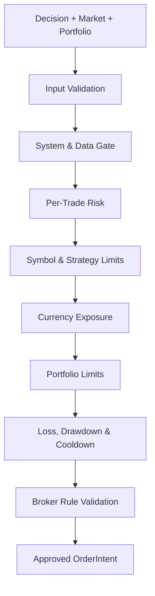

# 09 — Risk Management

## 1. Purpose

Risk Management ของ QuantoraTrade เป็นด่านบังคับระหว่าง Decision และ Execution มีหน้าที่ป้องกันการเปิดความเสี่ยงที่เกินข้อกำหนดในระดับ Order, Symbol, Currency, Strategy, Account และ Portfolio

Risk Engine ต้องเป็น deterministic, ทำซ้ำได้ และทำงานได้โดยไม่พึ่ง AI เมื่อข้อมูลไม่ครบหรือคำนวณไม่ได้ให้ **ปฏิเสธคำสั่ง** ตามหลัก fail closed

## Implementation Status

Phase 5 engineering implementation ครอบคลุม Decision Engine, cost-aware position sizing,
SL/TP และ bounded exit policy, daily loss/drawdown/cooldown, reconciled open/pending risk,
multi-currency exposure, PostgreSQL-backed scoped Kill Switch และ authoritative submission gate

ค่าที่ยังต้องปรับจากการทดลองรับผ่าน typed configuration และ policy ที่ไม่ครบจะ activate ไม่ได้
Phase 5 submission boundary อนุญาตเฉพาะ Paper adapter ใน Phase 6 และปฏิเสธ Backtest/Live broker
routing โดย Live ยังต้องผ่าน Phase 7 Security Review และ Owner Approval

เอกสารนี้กำหนดโครงสร้างและสูตรสำหรับการทดสอบ ค่า limit จริงยังเป็น Open Decision จนกว่าจะผ่าน Backtest, Paper Trade และ Owner Approval

## 2. Non-Negotiable Rules

- ทุก OrderIntent ต้องอ้างอิง RiskAssessment ที่ `approved=true`
- AI, Strategy และ API ไม่มีสิทธิ์แก้หรือข้าม Risk Engine
- ห้ามเปิดสถานะโดยไม่มี protective Stop Loss ตาม policy
- ห้าม Martingale
- ห้ามเพิ่ม lot หลังขาดทุนเพื่อเอาคืน
- ห้ามถัวสถานะที่ขาดทุนใน MVP
- ความเสี่ยงคำนวณจาก Equity ล่าสุดที่ reconcile แล้ว
- ค่าของ symbol ต้องอ่านจาก Broker Specification
- คำนวณด้วย Decimal/NUMERIC ไม่ใช้ binary floating point สำหรับเงินและ volume
- เมื่อ database, broker state หรือ symbol specification ไม่พร้อม ให้ block new entries
- Risk Limit เวอร์ชันใหม่ไม่มีผลย้อนหลังกับ order เดิมโดยไร้ audit

## 3. Risk Gate Sequence



Gate ใดไม่ผ่านต้องหยุดทันทีและคืน rejection code ที่ตรวจสอบได้

## 4. Required Inputs

### Decision

- decision ID
- symbol และ timeframe
- BUY/SELL
- strategy/version
- proposed entry
- structural stop candidate
- take-profit candidate
- expires_at

### Account and Portfolio

- balance
- equity
- free margin
- account currency
- open positions
- pending orders
- realized/unrealized P&L
- daily high-water mark
- last reconciliation timestamp

### Instrument

- digits และ point
- tick size และ tick value
- contract size
- volume min/max/step
- minimum stop distance
- trading/session status
- current bid/ask และ spread

### Policy

- risk policy version
- per-trade limit
- daily loss limit
- drawdown limits
- exposure/concentration limits
- symbol/strategy/session overrides
- cooldown rules
- slippage/spread limits

หาก required input ใดไม่ครบให้คืน `RISK_INPUT_INCOMPLETE`

## 5. Risk Hierarchy

| Level | ตัวอย่าง |
|---|---|
| System | Kill Switch, stale data, dependency failure |
| Account | Equity, margin, daily loss, drawdown |
| Portfolio | total open risk, gross/net exposure |
| Currency | USD/EUR/GBP/JPY directional concentration |
| Asset class | Metals หรือ Forex concentration |
| Symbol | XAUUSD/EURUSD position and pending-order limits |
| Strategy | allocation และ consecutive losses |
| Trade | stop distance, position size, reward-to-risk |
| Broker | min/max lot, lot step, stop level, market status |

ต้องผ่านทุกระดับ ไม่ใช้ค่าเฉลี่ยมาหักล้าง hard limit

## 6. Per-Trade Risk Budget

### Risk amount

[
R = E 	imes r
]

โดย:

- (R) = จำนวนเงินสูงสุดที่ยอมเสียตาม Stop Loss
- (E) = Account Equity ที่ผ่าน freshness check
- (r) = Risk fraction ต่อ Trade จาก policy

จากนั้นจำกัดด้วย budget ที่เหลือ:

[
R_{allowed} = min(R, R_{dailyRemaining}, R_{portfolioRemaining}, R_{strategyRemaining})
]

ค่าของ (r) สำหรับ Backtest อาจทดสอบหลายระดับ แต่ไม่มีค่าใดถือว่าอนุมัติสำหรับ Live จนกว่าจะบันทึกใน approved risk policy

## 7. Position Sizing

### Broker-normalized calculation

ใช้ tick specification จาก broker:

[
LossPerLot = rac{|Entry - Stop|}{TickSize} 	imes TickValue
]

[
RawVolume = rac{RiskAmount}{LossPerLot}
]

จากนั้น:

1. ปัดลงตาม `volume_step`
2. ตรวจ `volume_min` และ `volume_max`
3. คำนวณความเสี่ยงย้อนกลับจาก volume ที่ปัดแล้ว
4. ตรวจ margin
5. ตรวจ portfolio/currency exposure
6. ถ้า volume ต่ำกว่า minimum lot ให้ปฏิเสธ ไม่ปัดขึ้นจนเกิน risk

ห้ามใช้สูตร pip value แบบตายตัวกับทุก symbol เพราะ XAUUSD, EURUSD และ USDJPY มี digits, tick size และ tick value ต่างกัน

## 8. Stop Loss Validation

Stop Loss ต้อง:

- อยู่ฝั่งตรงข้ามกับทิศทาง trade
- อ้าง structural level หรือ ATR policy ที่ versioned
- ผ่าน broker minimum stop distance
- ไม่แคบกว่าความผันผวนขั้นต่ำตาม policy
- ไม่เกิน maximum stop distance ของ symbol/strategy
- ไม่อยู่ในตำแหน่งที่ทำให้ volume ต่ำกว่า minimum แล้วต้องเพิ่ม risk
- รวม spread/slippage buffer ตาม execution assumptions

หลังเปิด position:

- ห้ามเลื่อน Stop Loss ให้ขาดทุนเพิ่ม
- เลื่อนเข้าใกล้ได้เฉพาะ trailing/breakeven policy ที่ผ่านการทดสอบ
- ถ้า protective stop ไม่ถูกยืนยัน ให้เข้า Emergency State ทันที

## 9. Take Profit and Reward-to-Risk

[
RR = rac{|Target - Entry|}{|Entry - Stop|}
]

ก่อนอนุมัติต้องคำนวณ RR หลังหัก:

- spread
- commission
- expected slippage
- swap หากถือข้ามคืนตาม strategy

ถ้า effective RR ต่ำกว่า threshold ให้คืน `LOW_REWARD_RISK`

Take Profit อาจเป็น optional สำหรับ exit policy บางแบบ แต่ต้องมี defined exit rule และ maximum loss protection เสมอ

## 10. Open Risk

Open risk ของ position ประมาณจากระยะระหว่าง current/entry reference ถึง Stop Loss ตาม policy และ volume

[
PortfolioOpenRisk = sum_{i=1}^{n} OpenRisk_i + PendingOrderRisk_i
]

ต้องรวม pending orders เพื่อไม่ให้ส่งหลาย order พร้อมกันจนเกิน limit

Risk ที่ลดลงเพราะราคาเคลื่อนไปทางกำไรจะนับลดได้เมื่อ protective stop ได้รับการยืนยันจาก broker แล้วเท่านั้น

## 11. Portfolio Exposure

### Gross exposure

ผลรวมมูลค่าสัมบูรณ์ของทุก position

### Net exposure

ผลรวม exposure แบบมีทิศทาง

### Currency exposure

Forex position ต้องแตกเป็น base และ quote currency เช่น:

- BUY EURUSD: long EUR, short USD
- SELL GBPUSD: short GBP, long USD
- XAUUSD: long/short Gold เทียบ USD ตามทิศทาง

Risk Engine ต้องตรวจ exposure ทั้งก่อนและหลัง order สมมติ เพื่อป้องกันการถือหลายคู่ที่ซ้ำความเสี่ยง USD โดยไม่รู้ตัว

MVP เริ่มด้วย notional/currency aggregation และเพิ่ม covariance/correlation model หลังมีข้อมูลเพียงพอ

## 12. Correlation and Concentration

กฎ baseline:

- จำกัดจำนวน positions ที่มี currency exposure ทิศเดียวกัน
- จำกัด risk รวมของ asset class
- จำกัด risk รวมของ strategy
- จำกัด risk รวมต่อ symbol
- order ใหม่ต้องคำนวณ portfolio state แบบ `what-if`

Correlation matrix ใช้เป็น advisory/soft limit ในช่วงแรก เพราะ correlation เปลี่ยนตามเวลา Hard limits ต้องอิง exposure ที่อธิบายและทำซ้ำได้

## 13. Margin Safety

ก่อนอนุมัติ:

- ตรวจ free margin
- ประเมิน margin หลัง order
- รักษา margin buffer
- ใช้ leverage/account rules จาก broker
- ปฏิเสธเมื่อข้อมูล margin stale
- ไม่ใช้ maximum leverage เป็นเป้าหมาย

หลังเปิด position ให้ monitor margin level และ activate risk response ตาม threshold ที่กำหนด

## 14. Daily Loss Limit

Daily loss ต้องนิยามชัดเจนด้วย timezone ของ trading day และ reset policy

องค์ประกอบที่ควรนับ:

- realized P&L
- unrealized P&L ตาม policy
- commission
- swap
- fees
- slippage

เมื่อแตะ limit:

1. block new entries
2. cancel pending entry orders ตาม policy
3. แจ้งเตือนระดับ critical
4. ไม่ปิด position ทั้งหมดอัตโนมัติ เว้นแต่ emergency policy ระบุ
5. require authorized review ก่อนปลด block

ใช้ account equity high-water mark ภายในวันเพื่อป้องกันกำไรช่วงต้นวันถูกคืนตลาดเกิน limit ที่กำหนด

## 15. Drawdown Controls

### Definitions

[
Drawdown = rac{PeakEquity - CurrentEquity}{PeakEquity}
]

แยกอย่างน้อย:

- intraday drawdown
- rolling drawdown
- strategy drawdown
- account drawdown
- maximum historical drawdown

### Response levels

| Level | Action |
|---|---|
| Normal | trade ตาม approved policy |
| Caution | ลด new risk หรือจำกัด strategy |
| Halt | block new entries |
| Emergency | Kill Switch และ incident workflow |

Threshold จริงต้องมาจาก approved config ไม่ hard-code ใน source code

## 16. Consecutive Loss and Cooldown

ติดตามแยกตาม:

- account
- strategy
- symbol
- strategy + symbol

เมื่อถึง threshold:

- block setup ใหม่ใน scope ที่เกี่ยวข้อง
- เริ่ม cooldown ตามจำนวน bars หรือเวลา
- ห้ามเพิ่ม risk เพื่อ recover loss
- ปลดอัตโนมัติได้เฉพาะ policy ที่กำหนดไว้และไม่มี global halt
- บันทึก reason `CONSECUTIVE_LOSS_COOLDOWN`

Manual override ต้องมี authorization, reason และ audit

## 17. Spread, Slippage and Liquidity

### Pre-trade

- spread ไม่เกิน absolute limit
- spread ไม่เกิน ATR-relative limit
- price quote ไม่ stale
- market depth/volume ใช้เมื่อ provider รองรับ
- หลีกเลี่ยง rollover/illiquid session ตาม symbol config

### Post-trade

- บันทึก expected กับ actual price
- คำนวณ slippage
- aggregate แยกตาม symbol, session และ broker
- เมื่อ slippage ผิดปกติให้ยกระดับ caution/halt

## 18. News and Event Risk

News Agent ให้ข้อมูลได้ แต่การ block trade ต้องเป็น deterministic policy:

- event impact level
- affected currencies/assets
- pre-event block window
- post-event stabilization window
- behavior สำหรับ existing positions
- source freshness และ availability

เมื่อ calendar unavailable:

- Paper/Backtest ใช้ policy ที่บันทึกไว้
- Live ใช้ fail-safe ตาม config เช่น block symbols ที่พึ่ง event data

ห้ามให้ข้อความข่าวแก้ Risk Policy หรือสั่ง Execution

## 19. Session and Weekend Risk

ต่อ symbol ต้องกำหนด:

- allowed sessions
- rollover block window
- Friday cutoff
- weekend holding policy
- holiday/market closure behavior
- maximum holding duration

หาก broker session ต่างจาก config ให้ใช้ข้อจำกัดที่ปลอดภัยกว่าและแจ้งเตือน mismatch

## 20. Order and Position Limits

MVP defaults เป็น policy structure ไม่ใช่ค่าตัวเลขอนุมัติ:

- maximum open positions ต่อ account
- maximum position ต่อ symbol/strategy
- maximum pending orders
- one direction ต่อ symbol/strategy
- maximum order attempts ต่อ signal
- maximum retry count
- maximum position age
- no pyramiding
- no averaging down
- no hedged BUY/SELL ใน strategy เดียวกัน

## 21. Risk Assessment Contract

```json
{
  "risk_assessment_id": "risk_01J...",
  "decision_id": "dec_01J...",
  "policy_version": "risk-paper-v1",
  "symbol": "USDJPY",
  "approved": false,
  "rejection_codes": [
    "CURRENCY_EXPOSURE_LIMIT"
  ],
  "inputs": {
    "equity": "10000.00",
    "entry": "147.250",
    "stop_loss": "147.650",
    "tick_size": "0.001",
    "tick_value": "0.6800"
  },
  "result": {
    "risk_amount": "0.00",
    "volume": "0.00"
  },
  "created_at": "2026-08-15T15:00:00Z"
}
```

ค่าตัวเลขส่งและเก็บเป็น decimal string/NUMERIC

## 22. Rejection Codes

### System/Data

- `KILL_SWITCH_ACTIVE`
- `SYSTEM_NOT_READY`
- `DATABASE_UNAVAILABLE`
- `BROKER_DISCONNECTED`
- `STALE_DATA`
- `RISK_INPUT_INCOMPLETE`
- `UNKNOWN_SYMBOL_SPEC`
- `POSITION_NOT_RECONCILED`

### Market

- `MARKET_CLOSED`
- `SESSION_BLOCKED`
- `SPREAD_TOO_WIDE`
- `SLIPPAGE_RISK_HIGH`
- `NEWS_BLOCK`

### Trade

- `DECISION_EXPIRED`
- `INVALID_STOP_LOSS`
- `STOP_DISTANCE_TOO_SMALL`
- `STOP_DISTANCE_TOO_LARGE`
- `LOW_REWARD_RISK`
- `VOLUME_BELOW_MINIMUM`
- `INSUFFICIENT_MARGIN`

### Portfolio/Loss

- `TRADE_RISK_LIMIT`
- `SYMBOL_RISK_LIMIT`
- `STRATEGY_RISK_LIMIT`
- `PORTFOLIO_RISK_LIMIT`
- `CURRENCY_EXPOSURE_LIMIT`
- `DAILY_LOSS_LIMIT`
- `DRAWDOWN_LIMIT`
- `CONSECUTIVE_LOSS_COOLDOWN`
- `POSITION_LIMIT`

## 23. Kill Switch

### Scopes

- global
- broker/account
- asset class
- symbol
- strategy
- new entries only
- all trading actions

### Triggers

- manual activation
- daily loss/drawdown halt
- database unavailable
- broker reconciliation mismatch
- repeated duplicate/order errors
- protective stop missing
- stale data across active symbols
- clock drift
- unexpected Live configuration
- security incident

### Behavior

Kill Switch ต้อง:

1. persist state ใน durable store
2. block OrderIntent ใหม่
3. notify Worker/API/Operator
4. cancel eligible pending entry orders ตาม policy
5. ไม่ปิด positions แบบ blind
6. ให้ Position Protection/Reconciliation ทำงานต่อ
7. ต้องใช้ authorization สูงกว่าในการ deactivate
8. บันทึก actor, reason และ incident reference

## 24. Emergency Position Handling

Emergency ไม่เท่ากับปิดทุกอย่างทันทีเสมอ เพราะ market/broker อาจผิดปกติ

ลำดับ:

1. block new risk
2. query broker และ reconcile
3. ตรวจ protective orders
4. เลือก action ตาม approved emergency policy
5. ส่งคำสั่งแบบ idempotent
6. ยืนยัน fill/remaining exposure
7. แจ้งเตือนและเปิด incident
8. ห้าม resume จนผ่าน recovery checklist

## 25. Risk Policy Configuration

```yaml
risk:
  version: risk-paper-v1
  mode: paper
  account:
    risk_per_trade: null
    daily_loss_limit: null
    max_drawdown: null
    max_open_positions: null
    margin_buffer: null
  portfolio:
    max_open_risk: null
    max_currency_exposure: null
    max_asset_class_risk: null
  cooldown:
    consecutive_losses: null
    duration_bars: null
  symbols:
    XAUUSD:
      profile: gold_default
      max_spread: null
      session_policy: gold_session
    EURUSD:
      profile: forex_major
      max_spread: null
      session_policy: forex_major_session
```

ใช้ `null` ในเอกสารตัวอย่างเพื่อยืนยันว่าค่าจริงยังต้องตัดสินใจ ระบบต้องไม่เริ่ม Paper/Live หาก required limit ยังเป็น null

## 26. Risk Policy Lifecycle

สถานะ:

1. `draft`
2. `backtest_approved`
3. `paper_approved`
4. `live_approved`
5. `retired`

ทุกการเปลี่ยนต้องมี:

- semantic version
- config hash
- code commit SHA
- change reason
- test/backtest references
- approver และเวลา
- effective mode/environment

ห้ามแก้ policy version เดิม ให้สร้าง version ใหม่

## 27. Monitoring and Alerts

Metrics แยกตาม mode/symbol/strategy:

- approved/rejected assessments
- rejection codes
- risk amount
- open risk
- currency exposure
- margin level
- daily P&L
- drawdown
- consecutive losses
- spread/slippage
- unreconciled positions
- Kill Switch state

Critical alerts:

- Live Kill Switch
- missing protective stop
- exposure/risk limit breach
- database/broker unavailable
- reconciliation mismatch
- order state unknown
- risk policy/config mismatch

## 28. Reconciliation

Risk state ต้องเทียบกับ broker เป็นระยะและหลัง:

- order submission timeout
- fill/rejection
- restart
- connection recovery
- manual broker-side action
- partial fill
- stop/TP execution

หาก local กับ broker ไม่ตรง:

- block new entries
- mark affected state uncertain
- reconcile ด้วย external IDs
- ห้ามเดาหรือสร้าง position จากข้อมูลไม่ครบ
- เปิด incident เมื่อแก้อัตโนมัติไม่ได้

## 29. Backtest and Stress Testing

### Historical

- spread/commission/slippage
- gaps และ fast markets
- trend/range/high volatility
- multiple symbols พร้อมกัน
- portfolio/currency exposure
- consecutive loss sequences
- out-of-sample และ walk-forward

### Stress

- spread หลายเท่าของค่าปกติ
- slippage สูง
- stop gap-through
- broker disconnect
- delayed/stale quotes
- partial fill
- database failure
- restart ระหว่างมี position
- currency-correlated signals พร้อมกัน
- equity ลดก่อนคำนวณ order
- duplicate requests

### Monte Carlo

ใช้จำลอง:

- trade sequence
- slippage distribution
- win/loss clustering
- parameter uncertainty

ผลใช้กำหนด limit อย่างอนุรักษ์นิยม ไม่ใช้สร้างภาพว่าผลตอบแทนแน่นอน

## 30. Test Requirements

### Unit

- position sizing ต่อ symbol specification
- volume rounding down
- min/max/step validation
- stop direction/distance
- effective RR
- daily loss และ drawdown
- exposure decomposition
- cooldown
- policy precedence

### Property-based

- volume ที่อนุมัติต้องไม่ทำให้ calculated risk เกิน budget
- เพิ่ม stop distance แล้ว volume ต้องไม่เพิ่ม
- ลด equity แล้ว allowed risk ต้องไม่เพิ่ม
- rejected assessment ต้องสร้าง order ไม่ได้
- Kill Switch active แล้วทุก new entry ถูก reject

### Integration/concurrency

- stale account snapshot
- concurrent signals
- pending order risk
- partial fills
- duplicate idempotency key
- broker timeout
- restart/reconciliation
- policy version mismatch

## 31. Paper-to-Live Risk Gate

ก่อน Live Pilot:

- Risk unit/property/integration tests ผ่าน
- Paper Trade ใช้ policy เดียวกับ candidate Live policy
- ไม่มี unresolved critical risk incident
- daily loss/drawdown/Kill Switch ถูกทดสอบ
- broker specification refresh ผ่าน
- order/position reconciliation ผ่าน
- slippage/spread assumptions เทียบกับ Paper data
- exposure reports ตรวจด้วยมือ
- owner อนุมัติ limit และ capital cap
- rollback/emergency procedure ผ่าน rehearsal

## 32. Open Decisions

- account equity/capital สำหรับแต่ละ mode
- risk per trade
- daily loss limit
- caution/halt/emergency drawdown
- maximum portfolio open risk
- currency/asset-class exposure limits
- margin buffer
- maximum positions/orders
- loss-streak cooldown
- allowed sessions และ weekend policy
- spread/slippage limits ต่อ symbol
- emergency close behavior
- RPO/RTO ของ risk state
- ผู้มีสิทธิ์ deactivate Kill Switch

## 33. Definition of Done

Risk Management พร้อม implement เมื่อ:

- Risk Gate order และ rejection codes ถูกกำหนด
- position sizing ใช้ broker tick specification และ Decimal
- pending orders รวมใน open risk
- currency/portfolio exposure คำนวณแบบ what-if
- daily loss, drawdown และ cooldown ทดสอบได้
- Kill Switch durable และ block order ก่อน network call
- rejected assessment ไม่มี code path ไป Broker Adapter
- policy version trace ถึง order/fill ได้
- ค่า Live ทุกค่ามี Owner Approval และหลักฐาน Paper Trade
