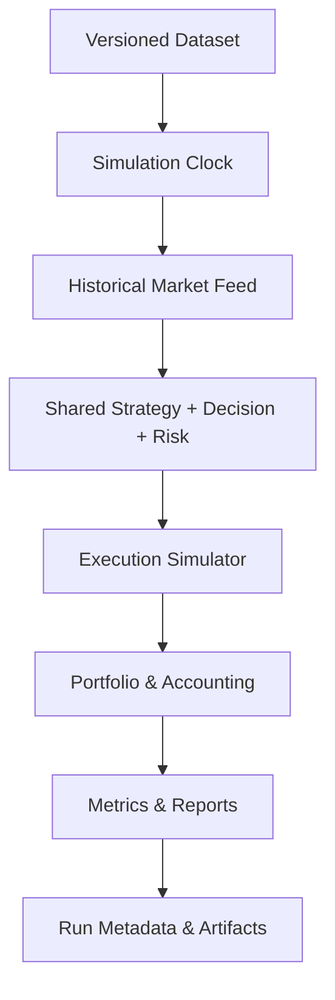
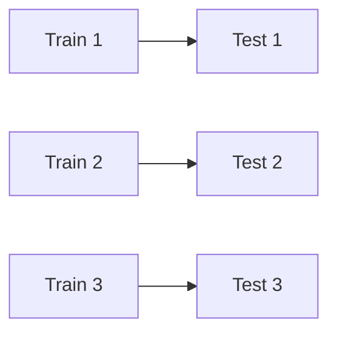

# 10 — Backtesting Framework

## 1. Purpose

Backtesting Framework ของ QuantoraTrade ใช้ทดสอบ Trading Logic และ Risk Policy ด้วยข้อมูลย้อนหลังอย่างทำซ้ำได้ โดยจำลองข้อจำกัดที่เกิดขึ้นจริง เช่น Spread, Commission, Slippage, Session, Partial Fill, Margin และ Multi-Asset Exposure

ผล Backtest เป็นหลักฐานประกอบการตัดสินใจ ไม่ใช่การรับประกันผลลัพธ์ในอนาคต Strategy ต้องผ่าน Out-of-Sample, Walk-forward และ Paper Trade ก่อนพิจารณา Live

## 2. Design Goals

- ใช้ Strategy, Decision และ Risk logic ชุดเดียวกับ Paper/Live
- รองรับหลาย Symbol และหลาย Timeframe
- ป้องกัน Look-ahead และ Data Leakage
- จำลองต้นทุนอย่างอนุรักษ์นิยม
- ทำซ้ำผลได้จาก Dataset, Code และ Config version เดิม
- ตรวจสอบทุก Trade ย้อนกลับถึง Candle และ Signal ได้
- เปรียบเทียบ Strategy กับ Baseline ที่เรียบง่าย
- รายงานทั้งผลตอบแทน ความเสี่ยง ความเสถียร และข้อจำกัด
- แยก Research Convenience ออกจาก Production Logic

## 3. Architecture



Backtest เปลี่ยนเฉพาะ Clock, Market Data Adapter และ Execution Adapter ส่วน business logic หลักต้องเป็นชุดเดียวกับ Paper/Live

## 4. Simulation Model

MVP ใช้ **event-driven bar simulation**:

1. Simulation Clock เลื่อนไปตามเวลาของแท่ง
2. ปิดแท่งของแต่ละ Symbol/Timeframe
3. ตรวจ Data Quality
4. คำนวณ Features
5. สร้าง Signal และ Decision
6. Risk Engine ประเมิน Portfolio ณ เวลานั้น
7. Execution Simulator ประมวลผล Order
8. อัปเดต Positions, Cash, Equity และ Events
9. บันทึก Snapshot/Metrics

ห้ามอ่าน high/low/close ของแท่งเดียวกันก่อนเวลาที่ logic กำหนด

### Implementation status

- Simulation clock เรียง event ด้วย `close_time → context timeframe → symbol → timeframe`
- Candle ที่ยังไม่ปิด, timeframe/duration ไม่ตรง หรือ identity ซ้ำทำให้ run หยุดทันที
- Market fill ใช้ราคาเปิดแท่งถัดไปและ adverse spread/slippage
- Portfolio state เป็น immutable snapshot และคำนวณ P&L ด้วย tick size/value ของ symbol
- Intrabar SL/TP ใช้ stop-first เมื่อแท่งเดียวแตะทั้งสองระดับ และใช้ราคาเปิดเมื่อ stop ถูก gap
- Engine เดิน pending signal → next-bar fill → protective exit → portfolio mark แบบ immutable
- Trade Journal ย้อนกลับจาก closed trade ถึง signal, opening fill และ closing fill ได้
- Gross P&L ใช้ reference prices ส่วน execution cost แยกผลของ spread/slippage ออกจาก commission
- Core metrics ครอบคลุม net return, expectancy, trade quality, streak และ high-water-mark drawdown
- Chronological split ตัด label overlap ด้วย purge และเว้นข้อมูลหลัง boundary ด้วย embargo
- Experiment config และ manifest ผูก code commit, dataset checksum, versions, cost scenario,
  random seed และ split membership เข้ากับ deterministic run ID
- Baseline report แยก overall, Training/Validation/Test และ per-symbol เทียบ no-trade baseline
- Artifact bundle สร้าง `summary.json`, `manifest.json`, `trades.json` และ `checksums.json`
- Margin, swap, partial fill, HTML/Parquet renderer และ complete experiment runner ยังอยู่ในงานถัดไป

## 5. Data Requirements

Dataset ต้องมี:

- canonical symbol และ broker/source symbol
- timeframe
- open/close timestamp เป็น UTC
- OHLC
- tick/real volume เมื่อมี
- spread หรือ spread model reference
- source/provider
- ingestion time
- revision/version
- checksum

Symbol specification ต้องมี:

- digits
- point
- tick size/value
- contract size
- volume min/max/step
- commission rules
- session/holiday rules
- margin/leverage assumptions

## 6. Data Validation Gate

ก่อน Run:

- timestamps เรียงลำดับ
- ไม่มี duplicate primary key
- ตรวจ missing bars ตาม session
- OHLC relationship ถูกต้อง
- ราคาและ volume ไม่เป็นค่าติดลบ
- timezone ชัดเจน
- ตรวจ stale/flatlined data
- ตรวจ extreme gaps และบันทึก ไม่ลบทิ้งอัตโนมัติ
- symbol specification ครบตลอดช่วงเวลา
- dataset checksum ตรงกับ metadata

Run ต้อง fail หาก issue ระดับ blocking ไม่ถูก resolve/waive พร้อมเหตุผล

## 7. Point-in-Time Correctness

### Closed-bar rule

Signal ณ เวลา (t) ใช้ได้เฉพาะข้อมูลที่เผยแพร่และปิดแล้วไม่เกิน (t)

### Multi-timeframe rule

M15 decision ใช้ H1 candle ล่าสุดที่ปิดแล้วเท่านั้น ห้าม forward-fill ค่า H1 จากแท่งที่ยังไม่ปิด

### News/External data

ใช้ได้เฉพาะข้อมูลที่มี point-in-time timestamp และ publication/revision history ถ้าไม่มี ให้ตัด News Agent ออกจาก historical comparison

### Symbol specification

ต้องใช้ specification ที่มีผล ณ ช่วงเวลานั้นเมื่อมีประวัติ หากมีเพียงค่าปัจจุบันต้องระบุ limitation ใน report

## 8. Anti-Leakage Rules

ห้าม:

- คำนวณ Support/Resistance ด้วย future bars
- normalize ทั้ง dataset ก่อนแบ่งช่วง
- fit scaler/model ด้วย Validation หรือ Test data
- เลือก parameter หลังดู Test result แล้วรายงานเป็น untouched test
- ใช้ revised macro/news value โดยไม่รู้ revision time
- ใช้ final daily high/low ใน intraday decision
- เลือก Universe จากสินทรัพย์ที่รู้ภายหลังว่ารอด/ทำกำไร
- drop losing trades เพราะข้อมูลไม่สมบูรณ์โดยไม่มี rule เดียวกันกับ Live

Transform ที่เรียนรู้ค่า ต้อง fit บน Training partition เท่านั้น

## 9. Dataset Splits

### Development split

- Training: สร้าง/fit model และทดลอง parameter
- Validation: เลือก variant และ threshold
- Test/Out-of-Sample: ประเมินครั้งสุดท้าย

ช่วงเวลาต้องเรียงตามลำดับ ห้าม random shuffle time series

### Purging and Embargo

ถ้า label/holding period ซ้อนข้าม boundary ต้อง purge samples ที่ overlap และเพิ่ม embargo ตามความเหมาะสม เพื่อลด leakage

วันที่และสัดส่วนจริงเป็น config ต่อ experiment และต้องแสดงใน report

Implementation ต้อง fail closed เมื่อ partition ว่าง, timestamp ไม่ใช่ UTC, sample ซ้ำ/ไม่เรียง,
label ข้าม purge boundary หรือ sample อยู่ใน embargo window โดย sample ที่ถูกตัดต้องบันทึกใน
`excluded` เพื่อ audit ได้ ห้ามลบทิ้งแบบเงียบ

## 10. Walk-Forward Analysis



รองรับ:

- expanding window
- rolling window
- retrain/recalibration frequency
- fixed out-of-sample horizon

ผลหลักต้อง aggregate จาก Test windows เท่านั้น และรายงานความแปรปรวนระหว่าง window

## 11. Execution Timing

ค่าเริ่มต้นแบบอนุรักษ์นิยม:

- Signal เกิดหลังแท่ง (t) ปิด
- Market entry ทำได้เร็วสุดที่ราคาเปิด/quote ที่เหมาะสมของแท่ง (t+1)
- ห้าม fill ที่ราคาปิดแท่ง (t) เว้นแต่พิสูจน์ว่า order พร้อมก่อนราคานั้น
- Limit/Stop orders ใช้ intrabar assumptions ที่ประกาศชัดเจน
- ถ้าแท่งเดียวชนทั้ง SL และ TP และไม่รู้ลำดับ ให้ใช้ conservative outcome หรือ higher-resolution data

## 12. Fill Model

Execution Simulator ต้องรองรับ:

- market order
- limit order
- stop order
- rejected order
- partial fill
- expired/cancelled order
- gap-through stop
- broker volume rounding
- minimum stop distance
- market/session closure

MVP อาจใช้ full fill สำหรับ liquid instruments แต่ต้องระบุ assumption และมี stress variant สำหรับ partial fill/rejection

## 13. Spread Model

ลำดับความน่าเชื่อถือ:

1. historical bid/ask
2. historical spread per bar/tick
3. session/symbol empirical spread model
4. fixed conservative spread

ต้องทดสอบอย่างน้อย:

- base spread
- elevated spread
- stress spread
- rollover/news widening

ห้ามใช้ spread เดียวของ XAUUSD กับ Forex ทุกคู่

## 14. Commission, Swap and Financing

Cost Model แยกตาม broker/account/symbol:

- commission per lot/side/round turn
- swap long/short
- triple-swap day
- financing/holding cost
- conversion เป็น account currency
- fees อื่นที่เกี่ยวข้อง

ถ้าข้อมูล swap ย้อนหลังไม่พร้อม ต้องระบุ omission และทำ sensitivity test

## 15. Slippage Model

รองรับ:

- fixed points/ticks
- percentage of spread
- percentage of ATR
- empirical distribution ตาม symbol/session/order side
- adverse-only stress slippage

Slippage ต้องใช้กับ Entry และ Exit รวมถึง Stop Loss การใช้ zero slippage อนุญาตเฉพาะ diagnostic baseline ไม่ใช่ผลหลัก

## 16. Intrabar Ambiguity

ข้อมูล OHLC ไม่บอกลำดับราคาในแท่ง

Policy:

- ใช้ lower timeframe/tick data เมื่อจำเป็น
- ถ้าไม่มี ให้เลือก conservative sequence
- รายงานจำนวน ambiguous bars/trades
- ทดสอบ best-case และ worst-case เป็น sensitivity bounds
- ห้ามเลือก sequence ที่ให้ผลกำไรมากกว่าโดยไม่มีหลักฐาน

## 17. Portfolio Simulation

Event queue ต้องรวมหลาย Symbol ตาม UTC เพื่อรักษาลำดับเหตุการณ์

Portfolio Engine ต้องติดตาม:

- cash/balance/equity
- realized/unrealized P&L
- margin/free margin
- open/pending risk
- symbol, currency, asset-class และ strategy exposure
- daily high-water mark
- drawdown
- Kill Switch/cooldown state

เมื่อ Signals เกิดพร้อมกัน ต้องใช้ deterministic priority policy เช่น event time, strategy priority และ canonical symbol เพื่อให้ผลทำซ้ำได้

## 18. Position Sizing in Backtest

ใช้ Risk Engine production code กับ historical account state และ historical/current symbol specification ตามข้อมูลที่มี

ต้องทดสอบ:

- Decimal precision
- volume rounding down
- min/max/step
- insufficient margin
- pending-order risk
- currency exposure
- dynamic equity compounding
- fixed-capital comparison

รายงานทั้ง compounding และ fixed-risk baseline เมื่อมีประโยชน์ เพื่อแยก Strategy edge ออกจากผลของ position sizing

## 19. Corporate/Market Events

สำหรับ Forex/Metals:

- session changes
- daylight-saving transitions
- holidays/early closes
- broker symbol rename
- contract/specification changes
- abnormal gaps
- rollover

เหตุการณ์ที่ไม่มีข้อมูลเพียงพอต้องกลายเป็น limitation หรือ exclusion rule ที่กำหนดก่อน Run

## 20. AI in Backtesting

Agent/Model ต้อง:

- pin provider/model/version เมื่อทำได้
- ใช้ temperature ต่ำ
- cache ด้วย input hash
- บันทึก prompt/output schema version
- ใช้เฉพาะ evidence ณ `as_of`
- ไม่เรียก live web/news สำหรับอดีตโดยไม่มี point-in-time dataset
- เทียบ deterministic baseline
- รายงาน latency, error และ cost

ถ้าทำซ้ำ exact output ไม่ได้ ให้ระบุ stochastic runs และวัด distribution แทนการรายงาน Run เดียว

## 21. Backtest Run Configuration

```yaml
backtest:
  run_name: trend_pullback_multi_asset_v1
  mode: backtest
  engine_version: "0.1.0"
  symbols: [XAUUSD, EURUSD, GBPUSD, USDJPY]
  entry_timeframe: M15
  context_timeframe: H1
  period:
    from: "2024-01-01T00:00:00Z"
    to: "2025-12-31T23:59:59Z"
  capital:
    initial_equity: null
    account_currency: USD
  execution:
    signal_fill: next_bar
    spread_model: historical_or_conservative
    slippage_model: empirical_or_stress
    commission_profile: broker_config
  versions:
    strategy: trend-pullback@1.0.0
    risk_policy: risk-backtest-v1
    feature_set: features-v1
    dataset: null
```

Required fields ที่เป็น `null` ต้องทำให้ Run fail validation

## 22. Reproducibility Manifest

ทุก Run ต้องบันทึก:

- run ID
- code commit SHA
- dirty-worktree flag; official run ต้อง false
- Python/dependency lock hash
- engine version
- strategy/risk/feature/model/prompt versions
- complete redacted config + hash
- dataset IDs/checksums
- symbol specifications
- random seeds
- execution assumptions
- timezone/calendar versions
- start/end/runtime
- hardware/runtime metadata เมื่อเกี่ยวข้อง

Official result ต้องสร้างใหม่ได้จาก Manifest

Implementation ปัจจุบันสร้าง run ID จาก SHA-256 ของ canonical config และ split membership
ดังนั้น config หรือ sample membership เปลี่ยนเพียงรายการเดียวจะกลายเป็นคนละ run โดยอัตโนมัติ
official experiment ปฏิเสธ dirty worktree และ report ระดับ baseline บังคับสถานะ
`RESEARCH_ONLY` ไม่ให้ใช้เป็นสิทธิ์เปิด Paper/Live Trading

## 23. Core Performance Metrics

### Return

- net profit
- total return
- annualized return เมื่อช่วงเวลายาวพอ
- monthly/annual return table

### Risk

- maximum drawdown
- drawdown duration
- volatility
- downside deviation
- Value at Risk/Expected Shortfall ใช้เป็น diagnostic ไม่ใช่ guarantee
- time under water

### Trade quality

- trade count
- win rate
- average win/loss
- payoff ratio
- profit factor
- expectancy
- average holding time
- maximum consecutive wins/losses
- MAE/MFE

### Risk-adjusted

- Sharpe ratio
- Sortino ratio
- Calmar ratio

ต้องระบุ annualization factor และข้อสมมติ ห้ามใช้ ratio เดียวตัดสิน Strategy

## 24. Cost and Execution Metrics

- gross vs net P&L
- execution cost จาก spread/slippage เทียบ reference prices
- commission
- swap/fees
- slippage
- fill/rejection rate
- partial fills
- gap losses
- P&L sensitivity ต่อต้นทุน

ถ้า Strategy ไม่รอดเมื่อเพิ่มต้นทุนอย่างสมเหตุผล ถือว่าไม่ robust

## 25. Segmentation

รายงานแยกตาม:

- symbol
- timeframe
- strategy/version
- long/short
- market regime
- session
- month/year
- volatility bucket
- spread bucket
- holding duration
- AI-assisted vs deterministic
- in-sample vs out-of-sample

ผลรวมที่ดีแต่พึ่ง Symbol/ช่วงเวลาเดียวต้องถูกชี้เป็น concentration risk

## 26. Benchmarking

เทียบอย่างน้อย:

- no-trade baseline
- simple rule baseline
- buy-and-hold เมื่อเหมาะกับสินทรัพย์/ช่วงเวลา
- Strategy แบบไม่ใช้ AI
- Strategy ก่อน/หลัง costs
- previous approved version

Benchmark ต้องใช้ช่วงข้อมูลและ cost assumptions เดียวกัน

## 27. Parameter Search

- กำหนด search space ก่อน Run
- แยก tuning data จาก final test
- บันทึกทุก trial ไม่เฉพาะผู้ชนะ
- จำกัดจำนวน trials
- ใช้ coarse-to-fine อย่างระมัดระวัง
- ตรวจ parameter stability neighborhood
- ลงโทษ complexity และ turnover
- ไม่เลือกค่าจาก peak แคบ

Final Test ใช้เพียงเพื่อยืนยัน หากกลับไปปรับ parameter ต้องถือว่า Test ถูกใช้แล้วและสร้าง untouched period ใหม่

## 28. Robustness Tests

- parameter perturbation
- spread/slippage stress
- delayed entry 1–N bars/ticks
- missed trades
- shuffled trade sequence
- reduced fill probability
- worse Stop fill
- symbol removal
- session exclusion
- alternate data source
- rolling subperiod
- regime breakdown

Strategy ที่ผ่านเฉพาะ assumption เดียวไม่ผ่าน promotion gate

## 29. Monte Carlo

จำลองอย่างน้อย:

- reorder trade sequence
- bootstrap returns/trades
- slippage variability
- win/loss clustering
- missed trades
- parameter uncertainty

รายงาน distribution ของ:

- terminal equity
- maximum drawdown
- longest loss streak
- probability of breaching risk limits
- recovery duration

Monte Carlo ไม่แก้ข้อเสียของ sample ขนาดเล็ก และห้ามตีความเป็นความน่าจะเป็นที่แน่นอนของอนาคต

## 30. Statistical Cautions

- รายงานจำนวน Trades และ confidence intervals เมื่อเหมาะสม
- ระวัง multiple testing/data snooping
- แยก economic significance จาก statistical significance
- ไม่สรุปผลจาก Win Rate อย่างเดียว
- ตรวจ autocorrelation และ clustered outcomes
- ผลลัพธ์น้อย Trades ถือว่าหลักฐานอ่อน
- ต้องเปิดเผย variants/trials ที่ทดสอบ
- ใช้ Deflated Sharpe หรือวิธีปรับ multiple testing ในระยะ research ขั้นสูง

## 31. Promotion Gate: Backtest to Paper

ค่า threshold จริงกำหนดใน Project Decisions แต่ต้องผ่านทุกหมวด:

### Integrity

- data validation ผ่าน
- ไม่มี known look-ahead/leakage
- reproducibility manifest ครบ
- official run มาจาก clean commit

### Performance

- net-of-cost positive expectancy ตามเกณฑ์
- out-of-sample ผ่าน
- walk-forward ไม่พึ่ง window เดียว
- trade count เพียงพอต่อการประเมิน
- drawdown อยู่ใน budget
- ไม่มี concentration ที่ไม่ยอมรับ

### Robustness

- cost/slippage stress ผ่าน
- parameter neighborhood เสถียร
- Monte Carlo risk อยู่ใน limit
- baseline comparison มีเหตุผล

### Operations

- Risk Engine cases ผ่าน
- event/order audit ครบ
- report และ trade replay ทำงาน
- limitations ถูกบันทึก

การผ่าน Backtest อนุญาตเพียง Paper Trade ไม่ใช่ Live Trade

## 32. Backtest Report Structure

1. Executive summary
2. Hypothesis
3. Dataset and split
4. Strategy/Risk versions
5. Execution assumptions
6. Integrity checks
7. Portfolio results
8. Per-symbol/timeframe results
9. Regime/session breakdown
10. Cost analysis
11. Drawdown and loss streaks
12. Walk-forward
13. Robustness and Monte Carlo
14. Benchmark comparison
15. Limitations
16. Promotion decision
17. Reproducibility manifest

## 33. Output Artifacts

- `summary.json`
- `metrics.parquet`
- `trades.parquet`
- `equity_curve.parquet`
- `events.parquet`
- `report.html`
- `report.pdf` optional
- `manifest.json`
- `config.snapshot.yaml`
- charts directory

MVP ปัจจุบันสร้าง JSON artifact bundle ในหน่วยความจำพร้อม checksum ก่อน ส่วน Parquet,
HTML/PDF และ Artifact Store persistence จะเพิ่มภายหลังโดยต้องรักษา canonical report schema เดิม

PostgreSQL เก็บ metadata/summary และ Artifact Store เก็บไฟล์ พร้อม SHA-256 checksum

## 34. Test Pyramid

### Unit

- clock/bar alignment
- indicators
- Signal/Decision rules
- Risk calculations
- cost models
- P&L/accounting
- order state transitions

### Property-based

- ไม่มี fill ก่อน order time
- Equity reconciliation ถูกต้อง
- costs ไม่ทำให้ net P&L มากกว่า gross P&L
- volume ไม่เกิน Risk budget
- Stop Loss downside ไม่ต่ำกว่าศูนย์อย่างผิดตรรกะ
- deterministic run ให้ hash เดิม

### Integration

- multi-symbol event ordering
- database/artifact persistence
- partial fill
- gap-through stop
- Kill Switch/daily loss
- restart from checkpoint

### Golden regression

Dataset ขนาดเล็กที่ตรวจด้วยมือและล็อก expected events, trades, metrics และ report hash ที่เหมาะสม

## 35. Performance Requirements

MVP ต้องให้ความถูกต้องมากกว่าความเร็ว

- deterministic event ordering
- chunked data loading
- จำกัด memory
- progress/checkpoint
- cancellation
- parallelize ระหว่าง independent runs ไม่ parallelize event order ภายใน portfolio run แบบทำให้ผลเปลี่ยน
- benchmark runtime ก่อน optimize
- vectorization ใช้ได้กับ Features แต่ต้องรักษา point-in-time semantics

## 36. Failure Policy

| Failure | Result |
|---|---|
| Dataset checksum mismatch | Fail run |
| Missing required symbol spec | Fail run |
| Blocking data-quality issue | Fail run |
| Invalid config/version | Fail run |
| AI timeout | ตาม fallback policy และนับ metric |
| Artifact write failure | Run incomplete |
| Database metadata failure | Run incomplete |
| Worker interrupted | Resume จาก validated checkpoint หรือ restart |
| Non-deterministic mismatch | Mark invalid for promotion |

## 37. Initial Implementation Order

1. Backtest config schema และ validation
2. Dataset manifest/loader
3. Simulation Clock และ multi-symbol event queue
4. Shared Feature/Strategy/Decision interfaces
5. Execution Simulator
6. Portfolio/P&L accounting
7. Shared Risk Engine
8. Costs และ intrabar policy
9. Metrics
10. PostgreSQL metadata + artifact outputs
11. HTML report
12. Walk-forward runner
13. Robustness/Monte Carlo suite
14. AI shadow evaluation

## 38. Open Decisions

- initial capital และ account currency
- official historical data source
- bid/ask หรือ bar data resolution
- exact train/validation/test periods
- walk-forward window
- base/stress spread and slippage models
- commission/swap profiles
- intrabar ambiguity policy
- promotion thresholds
- minimum trade count
- acceptable drawdown
- Monte Carlo methods/iterations
- official benchmark
- artifact storage and retention

## 39. Definition of Done

Backtesting Framework พร้อมใช้งานเมื่อ:

- multi-symbol event ordering deterministic
- closed-bar และ multi-timeframe alignment ผ่าน tests
- Strategy/Decision/Risk ใช้ code เดียวกับ Paper
- costs และ intrabar ambiguity ไม่ถูกละเลย
- official run สร้าง Reproducibility Manifest
- report แยก in-sample/out-of-sample และ per-symbol
- walk-forward และ robustness tests ทำงาน
- trade ทุกตัว replay ถึง source candles ได้
- Backtest promotion เปิดได้เฉพาะ Paper Mode
