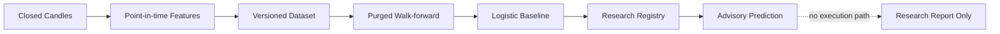

# 15 — AI Research Framework

## 1. Purpose

Phase 4 สร้างเครื่องมือวิจัย ML แบบ offline สำหรับทดสอบว่าโมเดลเพิ่มข้อมูลเหนือ baseline
จริงหรือไม่ โดยไม่เพิ่มสิทธิ์ให้ AI ส่งคำสั่ง คำนวณ lot ข้าม Risk Engine หรืออนุมัติ Paper/Live

ผลทุกชุดมีสถานะ `RESEARCH_ONLY` จนกว่าจะผ่านข้อมูลตลาดที่รับรอง, cost stress,
walk-forward หลาย fold และ final untouched holdout ตาม Research Evidence Base

## 2. Safety Boundary

`AdvisoryPrediction` มีเฉพาะ direction probability, confidence, model ID, feature schema
และเวลา observation โดยตั้งใจไม่มี volume, stop, target, order intent หรือ broker method

## 3. Point-in-Time Feature Pipeline

Feature schema รุ่นแรกคำนวณจาก closed candles และ Phase 2 deterministic engines เท่านั้น:

- one-bar return และ candle body/range เทียบ ATR
- EMA 9/21/50 gap เทียบ ATR
- RSI centered และ MACD histogram เทียบ ATR
- ระยะถึง support/resistance ที่ยืนยันแล้ว พร้อม presence flags
- Doji, Hammer, Shooting Star และ Bullish/Bearish Engulfing flags

แถว warm-up ที่ indicator ยังไม่ครบจะไม่ถูกสร้าง ทุก vector มี `observed_at`, source candle,
pipeline version และ schema SHA-256 การทดสอบ prefix invariance ยืนยันว่าการต่อ candle ในอนาคต
ไม่เปลี่ยน feature ที่สร้างไปแล้ว

## 4. Versioned Research Dataset

Dataset configuration ล็อก source dataset ID/SHA-256, feature config, hashes ของแต่ละ
symbol/timeframe series, label horizon และ neutral-return threshold ที่กำหนดล่วงหน้า
ทุก example มี `observed_at` และ `label_end_at`

ประวัติของแต่ละ symbol/timeframe คำนวณแยกกันก่อนรวมตามเวลา จึงไม่ผสมราคา/indicator ข้าม
instrument แถวที่ future return อยู่ใน neutral threshold ถูกนับเป็น excluded อย่างชัดเจน

## 5. Deterministic Baseline Model

Baseline รุ่นแรกเป็น L2-regularized logistic regression ที่เขียนด้วย `Decimal`:

- fit center/scale จาก training partition เท่านั้น
- ปฏิเสธ training ที่มีข้อมูลน้อยเกินไปหรือมี label class เดียว
- ล็อก feature schema, dataset hash, training example IDs และ hyperparameters
- model ID และ model hash ทำซ้ำได้จาก input เดิม
- inference ปฏิเสธ feature schema ที่ไม่ตรง model

Metrics หลักคือ accuracy, Brier score และ log loss เพื่อไม่เลือกโมเดลจาก hit rate เพียงอย่างเดียว

## 6. Leakage-Safe Walk-Forward

แต่ละ fold แบ่ง Training → Validation → Test ตามเวลา รองรับ expanding/rolling training,
purge และ embargo ตัวอย่างที่ `label_end_at` ข้าม boundary จะถูกตัดและเก็บ excluded IDs

Transform และ model ถูก fit ใหม่จาก training ของแต่ละ fold ไม่มีการ reuse center/scale หรือ weights
จาก validation/test ผล test ถูกถ่วงตามจำนวนตัวอย่างและเปรียบเทียบกับ no-skill training prior

## 7. Model Registry and Inference

Registry เป็น immutable snapshot และรับ model ใหม่ได้เฉพาะ `RESEARCH_ONLY`:

- `RESEARCH_ONLY`: ลงทะเบียนเพื่อ audit/offline evaluation
- `CHALLENGER`: เลือกได้หนึ่งตัวสำหรับการเปรียบเทียบ offline
- `RETIRED`: ปิด inference

ไม่มีสถานะ Production/Paper/Live ใน Phase 4 การเปลี่ยน lifecycle ไม่สามารถสร้าง execution
permission ได้

## 8. Golden Research Result

Synthetic multi-symbol fixture ใช้ XAUUSD/EURUSD จำนวน 260 labeled examples และ 9 folds:

| Metric | Logistic baseline | No-skill prior |
|---|---:|---:|
| Weighted OOS accuracy | 0.90 | รายงานแยกต่อ fold |
| Weighted OOS Brier | 0.126690744998752900607636254 | 0.09000359222829781471055241928 |

แม้ accuracy สูง แต่ Brier score แย่กว่า no-skill prior จึงไม่ผ่านการ promote และคง
`RESEARCH_ONLY` ผลนี้เป็น golden fixture สำหรับตรวจ pipeline/determinism ไม่ใช่หลักฐาน edge
ใน XAUUSD/Forex จริง

## 9. Required Real-Market Evaluation

ก่อนปิด empirical research gate ต้องเพิ่มโดยไม่แก้ผล final holdout ย้อนหลัง:

1. approved historical bid/ask หรือ documented spread model
2. XAUUSD และ Forex หลายช่วงตลาด รวม trend/range และ volatility regimes
3. base/adverse/stress costs 1.0x, 1.5x, 2.0x
4. frozen hyperparameters และ experiment registry ที่นับทุก trial
5. final untouched holdout หลังเลือก model เสร็จ
6. calibration, net expectancy, drawdown, turnover และ coverage พร้อม confidence intervals
7. เปรียบเทียบ deterministic technical baseline และ no-skill baseline

การไม่ผ่านข้อใดหมายถึง `HOLD / RESEARCH_ONLY` และไม่มีสิทธิ์เชื่อม execution

